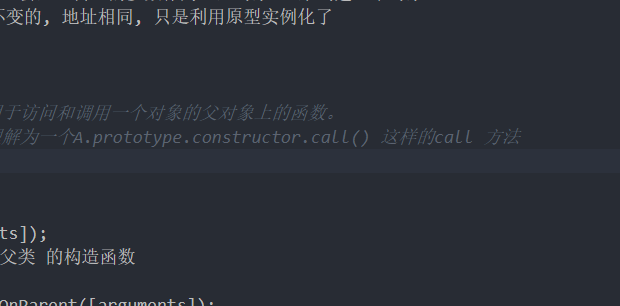

# ES6


## 组合继承
> 所谓组合继承就是 = 借用继承 + 原型继承， 并在此基础上做出点优化性调整
```
function Par(name) {
    this.name = name
}
Par.prototype.call = function() {
    console.log('我的名字' + this.name )
}

function Bar() {
    Par.apply(this, arguments)  
}

// new Par 的话会两次执行 Par内的方法， 所以使用Object.create
var __proto = Object.create(Par.prototype)
__proto.constructor = Bar
Bar.prototype = __proto

Bar.prototype.call = function() {
    super.call()
}
var b1 = new Bar('吴大龙')
console.dir(b1.call())
```
### 为何要使用 Object.create
> 关于Object.create的MDN说明           
> Object.create()方法创建一个新对象，使用现有的对象来提供新创建的对象的__proto__


* 老式的 Bar.prototype = new Par()， 会造成多一次的Par 方法调用
* Object.create 会基于传入的参数作为原型对象， 来创建一个对象
* 原本的原型是不变的, 地址相同, 只是利用原型实例化了


##  super 
> super关键字用于访问和调用一个对象的父对象上的函数。       
> 可以把super理解为一个A.prototype.constructor.call() 这样的call 方法


### 语法
```
super([arguments]); 
// 调用 父对象/父类 的构造函数

super.functionOnParent([arguments]); 
// 调用 父对象/父类 上的方法
```

### 描述
```
在构造函数中使用时，super关键字将单独出现，并且必须在使用this关键字之前使用。super关键字也可以用来调用父对象上的函数。
```

## Object.setPrototypeOf() 方法与 super
### MDN描述
>  简单理解 后面覆盖前面的prototype           
> Object.setPrototypeOf() 方法设置一个指定的对象的原型 ( 即, 内部[[Prototype]]属性）到另一个对象或  null          

> 警告: 由于现代 JavaScript 引擎优化属性访问所带来的特性的关系，更改对象的 [[Prototype]]在各个浏览器和 JavaScript 引擎上都是一个很慢的操作。其在更改继承的性能上的影响是微妙而又广泛的，这不仅仅限于 obj.__proto__ = ... 语句上的时间花费，而且可能会延伸到任何代码，那些可以访问任何[[Prototype]]已被更改的对象的代码。如果你关心性能，你应该避免设置一个对象的 [[Prototype]]。相反，你应该使用 Object.create()来创建带有你想要的[[Prototype]]的新对象。


### 将obj2的原型加到obj1上
```
var obj1 = {
    method1() {
      console.log("method 1");
    }
  }

  var obj2 = {
    method2() {
    super.method1();
    }
  }

  Object.setPrototypeOf(obj2, obj1);
  obj2.method2(); 
```
