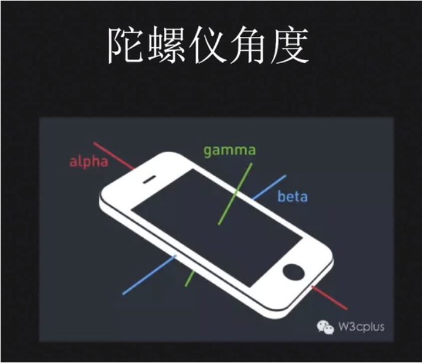
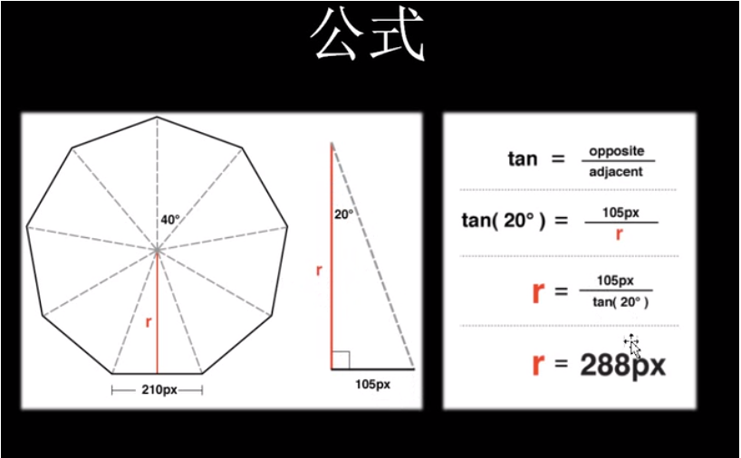
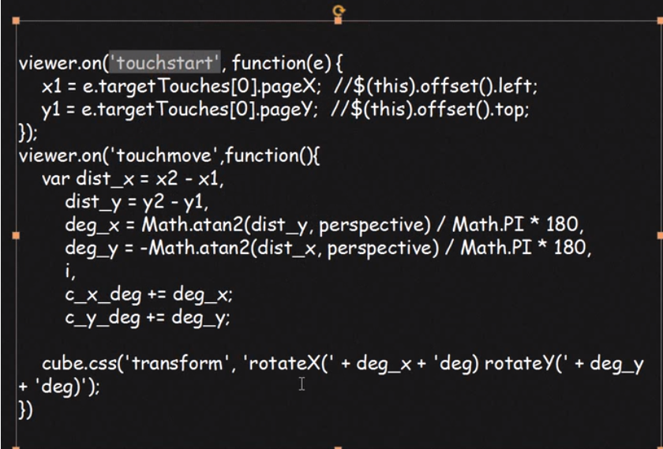

>经典网站         
>[https://720yun.com/](https://720yun.com/)         
>[http://www.h5doo.com/](http://www.h5doo.com/)

>css3d 的库 css3d-engine
>JS 3d 的库 parallax.js [轻量级的视差引擎]
## 
## 陀螺仪
>角度传感器, 是不同于加速计(G-sensor)的, 他的测量物理是偏转、倾斜时的转动角度.在手机上, 仅用加速计没办法测量或重构出完整的3D动作, 测不到转动的动作, G-sensor只能检测轴向的线性动作.但陀螺仪则可以对转动、偏转的动作做很好的测量, 这样就可以精确分析判断出使用者的实际动作. 而后根据动作, 可以对手机做相应的操作

##  陀螺仪角度
>真实开发中, 数值偏移可能会比较大, 需要开发者适当控制
* 沿 z 轴转对应图中的gamma值 ( 0, 360 )
* 沿 x 轴转对应图中的beta值 ( -180, 180 )
* 沿 y 轴转对应图中的alpha值 ( -90, 90 )




# 相关api 
* deviceorientation  
>设备的物理方向信息, 表示为一系列本地坐标系的旋角
* devicemotion
>提供设备的加速信息
* compassneedscalibration
>用于通知Web站点使用罗盘信息校准上诉事件

### 监听用户旋转
```
 window.addEventListener('deviceorientation', (event) => {
      // 处理 event.alpha 、 event.beta 及event.gamma
      console.log(event.alpha)
    }, true)

```

### 获取罗盘校准
>需要罗盘校准的情况下调用,  否者出现 alpha, gamma 等值不正确的情况
```
 window.addEventListener('compassneedscalibration', (event) => {
    alert('你的罗盘需要校准')
    // 清除默认事件
    event.preventDefault()
```


### 获取重力加速度

>静止的话使用 event.acceleration
>比如扔出手机时, 建议使用 event.rotationRate
```
window.addEventListener('devicemotion', (event) => {
  // 处理event.acceleration
  // x(y,z) : 设备在x(y,z) 方向上的移动加速度值
  // event.accelerationIncludingGravity
  // 考虑了中立加速度后设备在x(y,z)
  // event.rotationRate
  // alpha, beta, gamma: 设备绕x, y, z 轴旋转的角度
}, true)
```


## 重力公式
>重力加速度是一个物体受重力作用的情况下所具有的加速度
>与位置有关; ( G = mg ) (其中 g= 9.80665 m/s^2,  为标准重力加速度)


## 简单的摇一摇实现代码
```
 // --------------摇一摇实践----------------
  var speed = 30; // speed
  var x = y = z = lastX = lastY = lastZ = 0
  function deviceMotionHandler(eventData) {
    var acceleration = event.accelerationIncludingGravity
    x = acceleration.x
    y = acceleration.y
    z = acceleration.z
    if(Math.abs(x-lastX) > speed || Math.abs(y-lastY) > speed || Math.abs(z-lastZ) > speed ) {
      // 简单的摇一摇触发代码
      alert(1)
    }
  }

```


## 造物节3D效果原理简单描述
>先转后推, 首先将一张大图切为9份,  然后每张图旋转40度,  然后并将其推至合适位置



### 集合Touch事件交互
>用户对于3d实景的一些交互操作, 利用 touchstart 和 touchmove 事件做相应处理



