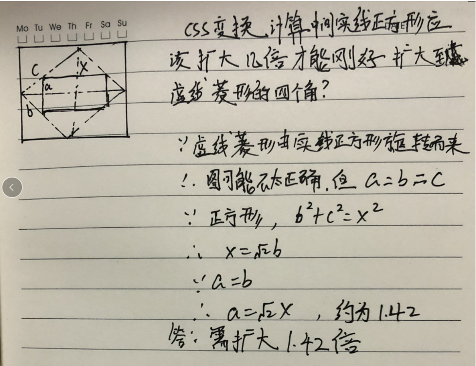
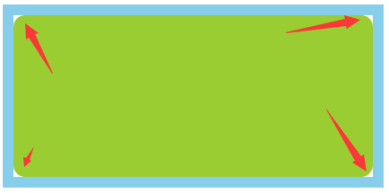
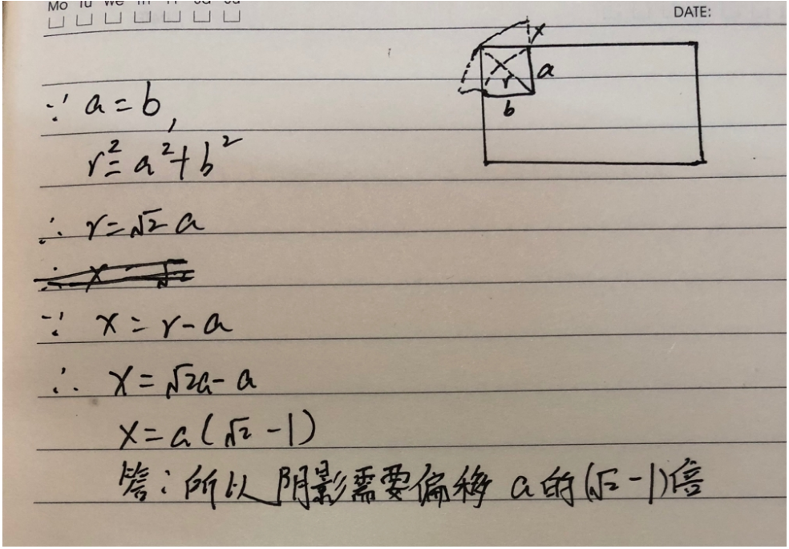

## 图片裁切动画
> 利用clip-path 的小技巧做出类似相框的效果

> 关键的css
```
.avatar {
    clip-path: polygon(0 0,  100% 0, 100% 100%, 0 100%);
    transition: all 0.5s;
    
}
.avatar:hover {
    transition: all 0.5s;
    clip-path: polygon(50% 0,  100% 50%, 50% 100%, 0 50%);
}
```

## 计算图片旋转后扩大倍数
> 要的效果


> 要说的比较多， 就手写了, 字贼丑，对不住看官老爷




## 计算圆角空白的阴影填充距离
在我们需要实现一个矩形中套一个圆角矩形的需求时， 我们可以使用阴影填充

需要解决的问题， 边边角角的空白




这就是我们最终要实现的效果


为了实现这个效果我们就需要计算阴影需要向外部扩散多少距离才能刚好填充满空白区域


计算过程如下: 

