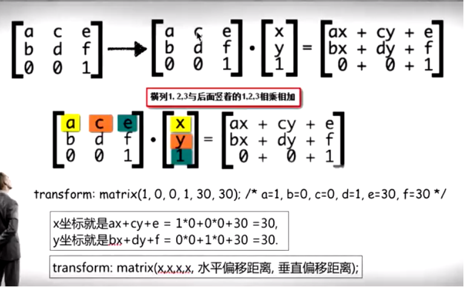
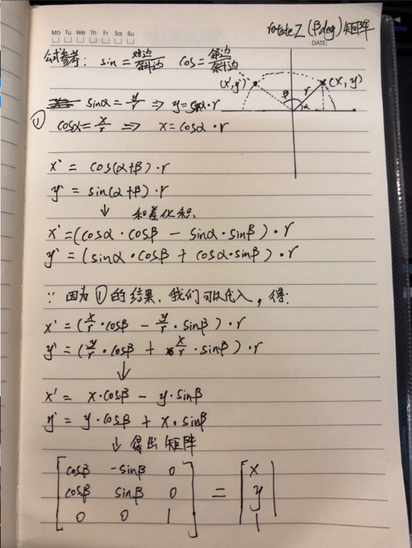
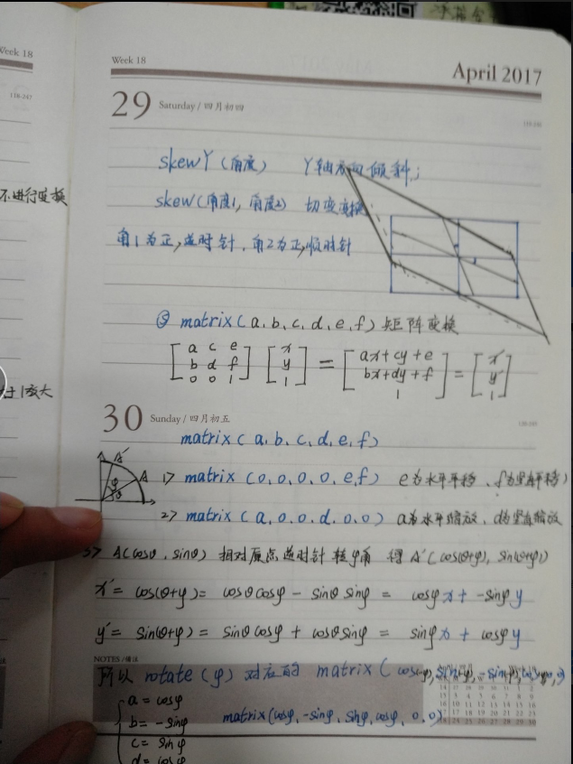
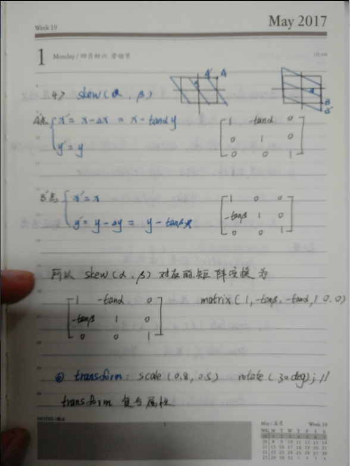

# 矩阵
1. matrix(a,b,c,d,e,f);        
2. a c e 分别和 X, Y, 1 相乘得出线性方程
3. b d f 分别和 X, Y, 1 相乘得出线性方程

这是很清楚的计算公式

## rotateZ矩阵推理
推理过程

## 可生成matrix的网站

名称 | 网址
---|---
matrix3d | http://ds-overdesign.com/transform/matrix3d.html
CSS-Matrix3d | https://github.com/Zhangdroid/CSS-Matrix3d
matrix | http://meyerweb.com/eric/tools/matrix/
tools  | http://www.f2e.name/case/css3/tools.html

## 参考同学的笔记
同学写的很不错👍

