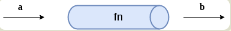
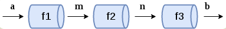
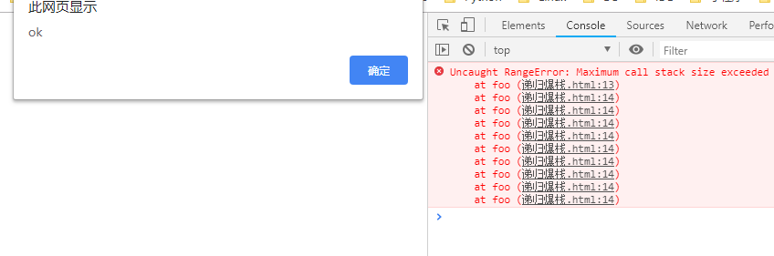

# 函数式编程

## 范畴论
苦涩难懂， 并没有完全理解，我的理解： 
态射： 只要两者之间存在某种关系， 就可以进行态射。

笔记: 
1. 函数式编程时范畴论的数学分支是一门很复杂的数学， 认为世界上所有概念体系都可以抽象出一个个范畴

2. 彼此之间存在某种关系概念、 事物、对象等等，  都构成范畴。 任何事物只要找出他们之间的关系， 就能定义

3. 箭头表示范畴成员之间的关系， 正式的名称叫做“态射”(morphism)。范畴论认为， 同一个范畴的所有成员， 就是不同状态的“变形”(transformation)。通过“态射”， 一个成员可以变形成另一个成员。

## 函数式编程的基础理论
用数学的思维去驱动编程
函数式编程中没有`if else`、没有 `switch`
1. 函数式编程 ( Functional Programming) 其实相对于计算机的历史而言是一个非常古老的概念， 甚至早于第一台计算机的诞生。 函数式编程的基础模型来源于 `入(Lambda x => x*2)` 演算， 而 `入` 演算并非设计于在计算机上执行， 它是在 20 世纪三十年代引入的一套用于研究函数定义、函数应用和递归的形式系统。

2. 函数式编程不是用函数来编程， 也不是传统的面向过程编程。 主旨在于将复杂的函数符合成简单的函数（计算理论， 或者递归论， 或者兰姆达演算） 。 运算过程尽量携程一系列嵌套的函数调用。

3. Javascript是披着C外衣的Lisp; Lisp是一门纯函数式编程的语言。 但是 JS原本设计值初并没有考虑面向对象， 面向对象是后来应需求加入的， 慢慢的就朝着面向对象走了。

4. 真正的火热是随着React的高阶函数而逐步升温。


## 函数式基本
1. 函数是一等公民。所谓”第一等公民”（first class），指的是函数与其他数据类型一样，处于平等地位，可以赋值给其他变量，也可以作为参数，传入另一个函数，或者作为别的函数的返回值。

2. 不可改变量。在函数式编程中，我们通常理解的变量在函数式编程中也被函数代替了：在函数式编程中变量仅仅代表某个表达式。这里所说的’变量’是不能被修改的。所有的变量只能被赋一次
初值

3. map & reduce他们是最常用的函数式编程的方法。

1.  函数是”第一等公民”
2. 只用”表达式"，不用"语句"
3. 没有”副作用"
4. 不修改状态
5. 引用透明（函数运行只靠参数）

## 专业术语

* 纯函数
* 函数柯里化
* 函数组合
* point Free
* 声明式与命令式代码
* 惰性求值


### 纯函数
对于相同的输入， 永远会得到相同的输出， 而且没有任何可观察的副作用， 也不依赖外部环境的状态。

如果函数返回结果有一定的随机成分那就不算是纯函数

**优点**
可缓存性: 因为纯函数的返回结果根据传入的值是永远一致的， 所以我们可以存储保存结果 ，只需要一次计算， 第二次直接就可以返回， 比如`lodash`的中`_.memorize`方法


### 非纯改为纯
利用函数柯里化， 将一部分固定不变的参数锁住，让有随机性的值或参数放在第二次调用时传入， 以达到类似纯函数的目的


## 函数柯里化
柯里化是一种“预加载”函数的方法，通过传递较少的参数，
得到一个已经记住了这些参数的新函数，某种意义上讲，这是一种
对参数的“缓存”，是一种非常高效的编写函数的方法


## 函数组合
使用纯函数和柯里化会经常写成洋葱圈的样子`f(g(a(x)))` 类似这样。
为了避免函数的重复嵌套, 我们需要使用`函数组合`的方式

就是类似于搭积木， 提供一个拼接函数， 构建好组合的模式， 然后根据用户传入参数
```
function composer(a, b) {
  return a(b())
}
// 自由传入你的函数， 可以调换顺序， 拼接模式已被预设
console.log(composer((x) => 3 + x, ()=> 1))
```

使用函数组合会使代码更灵活
这就涉及到数学中的组合问题


## Point Free
> 本笔记观看阮一峰教程后实践编写

> Pointfree 就是如何使用函数式编程的答案 --- 阮一峰

我们可以把数据处理的过程，定义成一种与参数无关的合成运算。不需要用到代表数据的那个参数，只要把一些简单的运算步骤合成在一起即可。

Pointfree 的本质就是使用一些通用的函数，组合出各种复杂运算。上层运算不要直接操作数据，而是通过底层函数去处理。这就要求，将一些常用的操作封装成函数。


### 函数的拆分与合成
程序的运行过程无非就是 输入a 返回 b， 但在a 变为b的过程中， 我们可以细分， 比如 `a -> m -> n -> b` ,这样中间多了两个中间过渡值`m`和 `n`, 

就像一根水管， 传入的a 流向了 b端



拆分成三根水管， a 要经过水管 f1 得到 m 然后传入函数f2 得到 n ,最后通过水管f3得到 b



细分了过程， 但结果相同，并且使得过程可替换了， 这个水管不好用了可以立马换其他的， 而不是整根替换， 过程可控了

让我们来看一个简单的例子， 

在一段字符串中找出最长的字符长度
首先， 我们定义一个pipe 函数， 把它接收的参数想象成一段一段的水管, 他负责按顺序拼接你传的"水管"， 将上一个`水管`返回的值, 

顺便说一下这个pipe用了尾递归

```
// 将上一次的计算结果传给下一个函数
function pipe(...args) {
  const argsCopy = [...args]
  return function (str) {
    return (function loop(val) {
      if( argsCopy.length == 0 ) {
        return val
      }
      const result = argsCopy.shift()(val)
      return loop(result)
    })(str);
  }
}
```

秉承着函数的单一职责， 我们编写了许多个“水管”， 分别处理不同的步骤

```
// 找出这段字符串最长的单词
var words = "aa bb cc ccccc"

// map 
const arrMap = (arr, callback) => Array.prototype.map.call(arr, callback)

// 根据空格分割成数组
const splitBySpace = str => str.split(' ')

// 获取字符长度
const getLen = str => str.length

// 字符串转长度
const str2length = arr => arrMap(arr, getLen)

// 逆序排序
const sortByDesc = arr => [].sort.call(arr, (a, b) => b - a)

// 获取数组第一个
const getArrFirst = (arr) => arr[0]
```

然后我们按部就班的排好顺序，传入pipe 

整理下思路
字符串转为数组 -> 将数组中的单词转为长度 -> 根据字符长度逆序排序 -> 然后获取第一个也就是最大的值

```
console.log( 
  pipe(
    // 根据空格分割
    splitBySpace, 
    // 将数组中的单词转为长度
    str2length, 
    // 根据字符长度逆序排序
    sortByDesc,
    // 获取第一个也就是最大的值
    getArrFirst

    // 传入字符
  )(words)
)

```


## 声明式与命令式代码
命令式代码的意思就是，我们通过编写一条又一条指令去让计算机执行一些动作，这其中一般都会涉及到很多繁杂的细节。而声明式就要优雅很多了，我们通过写表达式的方式来声明我们想干什么，而不是通过一步一步的指示。

```
//命令式
let CEOs = [];
for(var i = 0; i < companies.length; i++)
CEOs.push(companies[i].CEO)
}
//声明式
let CEOs = companies.map(c => c.CEO);
```

## 函数式编程的优缺点

**优点**
函数式编程的一个明显的好处就是这种声明式的代码，对于无副作用的纯函数，我们完全可以不考虑函数内部是如何实现的，专注于编写业务代码。优化代码时，目光只需要集中在这些稳定坚固的函数内部即可。

**缺点**
相反，不纯的函数式的代码会产生副作用或者依赖外部系统环境，使用它们的时候总是要考虑这些不干净的副作用。在复杂的系统中，这对于程序员的心智来说是极大的负担。


## 惰性求值、惰性函数、惰性链
惰性其实就是延迟的一次， 让函数在当他用到的时候再去执行， 

惰性函数呢一般用在规避重复的浏览器能力检测， 因为这个特性只需要排查一次就知道结果了， 重复的去排查性能未免太差

惰性链的大致实现就是，先暂时存储方法， 不去执行， 等到调用执行方法时再统一执行


## 偏函数和偏应用函数
偏函数通熟易懂的讲就是单个参数的函数

为什么叫偏 ， 因为一个函数只能处理一个逻辑， 比如 Bind

> 偏函数用法是指创建一个 调用另一个部分——参数或变量已经预置的的函数 的函数的用法


一个函数通过预先填充原始的部分创建一个新函数

柯里化就是偏函数的一个应用


## 函数式编程专业术语
* 高阶函数
* 尾调用优化
* 闭包
* 容器、Functor
* 错误处理、Either、AP
* IO
* Monad


## 高阶函数
* 它是一等公民
* 它已一个函数作为参数
* 已一个函数作为返回结果

高阶函数就是对已封装的函数再进行一次封装， 然后返回这个函数， 达到更高程度的抽象


## 爆栈和死循环的区别
**死循环**
是持续性的占用线程， 导致线程饥渴， 线程无力去执行其他的事件， 导致浏览器失去交互能力和响应， 相当于一口气吃了个咽不下的大面包， 你无力再去吃其他的了

无法再执行更多的Js

**爆栈**
有进有出， 类似于吃的过撑了， 但是它会吐出来，爆栈是存留过多导致的 ， 每个函数都很小， 但慢慢的越变越大会把你撑死, 浏览器依旧可交互
```
function foo() {
    foo() 
}
foo()
```
**爆栈依旧能调用点击事件**



## 尾调用优化
**浏览器实现**
浏览器暂未很好的实现， 原本草案浏览器自身实现的优化， 只需要在你函数名前面加上`#`号即可, 如`#function() {}` 这样， 浏览器会将你的递归代码变成循环， 只保留最后一个执行栈， 但是不利于调试， 如果你使用`try catch` 去捕获异常只能拿到最后的一个错误信息， 估计也就是这样草案被驳回了

**这是浏览器实现原理**
> 在ECMAScript 6，我们将迎来尾递归优化，通过尾递归优化，javascript代码在解释成机器码的时候，将会向while看起，也就是说，同时拥有数学表达能力和while的效能。


**自己实现**
在函数的末尾调用另一个函数， 然后将当前的值传给该函数， 再经由该函数调用自身， 继续计算结果， 来回的切换函数以达到类似循环的效果， 防止栈溢出

```
function foo(x, sum) {
    if(x == 1) {
        return sum 
    }
    return foo2(--x, sum + x) 
}
function foo2(...args) {
    return foo(...args)
}
console.log(foo(1000, 0)) // 499500
```


## 递归和尾递归

**递归**   
普通递归时，内存需要记录调用的堆栈所出的深度和位置信息。在最底层计算返回值，再根据记录的信息，跳回上一层级计算，然后再跳回更高一层，依次运行，直到最外层的调用函数。在cpu计算和内存会消耗很多，而且当深度过大时，会出现堆栈溢出

因为递归会导致`ESC stack` 创建新的函数执行栈，大量保存栈的记录，就会导致栈的溢出， 就好像你一直吃零食把自己吃撑死了

**尾递归** 

函数尾调用自身， 也就是在所有其他操作都执行完才调用自身，叫做尾递归， 因为函数执行会有监测, 当一个函数以后都没有用的时候就把他出栈了， 所以就只保留一个函数的执行栈了。


整个计算过程是线性的，调用一次`sum(x, total)`后，会进入下一个栈，相关的数据信息和跟随进入，不再放在堆栈上保存。当计算完最后的值之后，直接返回到最上层的


这是一个的尾递归demo， 在foo的最底部调用了自身， 在调用自身前，当前函数已全部执行完毕， 包括 `--x`和`sum+x` ， 

```
function foo(x, sum) {
    if(x == 1) {
        return sum 
    }
    return foo(--x, sum + x) 
}
console.log(foo(1000, 0)) // 499500
```


### ECS的含义
　  一系列活动的执行上下文从逻辑上形成一个栈。栈底总是全局上下文，栈顶是当前（活动的）执行上下文。当在不同的执行上下文间切换（退出的而进入新的执行上下文）的时候，栈会被修改（通过压栈或者退栈的形式）。
* 压栈：全局EC-->局部EC1-->局部EC2-->当前EC 
* 出栈：全局EC<--局部EC1<--局部EC2<--当前EC


## 函数式编程库
* RxJs[frp]
* cycleJs
* lodashJS、 lazy(惰性求值)
* underscoreJS
* ramdajs


## Rxjs
响应式编程是继承自函数式编程，声明式的，不可变的，没有副作用的是函数式编程的三大护法。其中不可变武功最高深。一直使用面向对象
范式编程的我们，习惯了用变量存储和追踪程序的状态。RxJS从函数式编程范式中借鉴了很多东西，比如链式函数调用，惰性求值等等。
在函数中与函数作用域之外的一切事物有交互的就产生了副作用。比如读写文件，在控制台打印语句，修改页面元素的css等等。在RxJS中，把副作用问题推给了订阅者来解决。


## Cycle.js
Cycle.js 是一个基于 Rxjs 的框架，它是一个彻彻底底的 FRP 理念的框架，和 React 一样支持 virtual DOM、JSX 语法，但现在似乎还没有看到大型的应用经验。

本质的讲，它就是在 Rxjs 的基础上加入了对 virtual DOM、容器和组件的支持


## Underscore.js
Underscore 是一个 JavaScript 工具库，它提供了一整套函数式编程的实用功能，但是没有扩展任何 JavaScript 内置对象。 他解决了这个问题：“如果我面对一个空白的 HTML 页面，并希望立即开始工作，我需要什么？” 他弥补了 jQuery 没有实现的功能，同时又是 Backbone 必不可少的部分。

Underscore 提供了100多个函数，包括常用的：map、filter、invoke— 当然还有更多专业的辅助函数，如：函数绑定、JavaScript 模板功能、创建快速索引、强类型相等测试等等。


## RamdaJs
lodash是一个具有一致接口、模块化、高性能等特性的JavaScript工具库，是underscore.js的fork，其最初目标也是“一致的跨浏览器行为。。。，并改善性能”。

lodash采用延迟计算，意味着我们的链式方法在显式或者隐式的value()调用之前是不会执行的，因此lodash可以进行shortcut（捷径） fusion（融合）这样的优化，通过合并链式大大降低迭代的次数，从而大大提升其执行性能。

就如同jQuery在全部函数前加全局的$一样，lodash使用全局的_来提供对工具的快速访问。


## 范畴与容器
1. 我们可以把”范畴”想象成是一个容器，里面包含两样东西。值（value）、值的变形关系，也就是函数。

2. 范畴论使用函数，表达范畴之间的关系。

3. 伴随着范畴论的发展，就发展出一整套函数的运算方法。这套方法起初只用于数学运算，后来有人将它在计算机上实现了，就变成了今天的”函数式编程"。

4. 本质上，函数式编程只是范畴论的运算方法，跟数理逻辑、微积分、行列式是同一类东西，都是数学方法，只是碰巧它能用来写程序。为什么函数式编程要求函数必须是纯的，不能有副作用？因为它是一种数学运算，原始目的就是求值，不做其他事情，否则就无法满足函数运算法则了。

## 范畴与容器
> 容器在有了Map后就成为了函子
1. 函数不仅可以用于同一个范畴之中值的转换，还可以用于将一个范畴转成另一个范畴。这就涉及到了函子（Functor）。
2. 函子是函数式编程里面最重要的数据类型，也是基本的运算单位和功能单位。它首先是一种范畴，也就是说，是一个容器，包含了值和变形关系。比较特殊的是，它的变形关系可以依次作用于每一个值，将当前容器变形成另一个容器。


## 容器、Functor（函子）
**ppt笔记**
* $(...) 返回的对象并不是一个原生的 DOM 对象，而是对于原生对象的一种封装，这在某种意义上就是一个“容器”（但它并不函数式）。
* Functor（函子）遵守一些特定规则的容器类型。
* Functor 是一个对于函数调用的抽象，我们赋予容器自己去调用函数的能力。把东西装进一个容器，只留出一个接口 map 给容器外的函数，map 一个函数时，我们让容器自己来运行这个函数，这样容器就可以自由地选择何时何地如何操作这个函数，以致于拥有惰性求值、错误处理、异步调用等等非常牛掰的特性。

**自己的解释**
老袁说面向对象讲究的是父与子的关系， 而函数是编程讲究的是兄弟和兄弟之间的联系， 函子与函子是平级的， 因为语言实现的问题， 所以需要使用到`new` ， 但为了看起来不像面向对象`oo` ，函数式编程约定了一个of方法， 把`new` 操作封装到了of方法里， 传入值就可以返回一个新的函子， 并且map方法也可以态射到另一个函子

以下是代码实现
```
const Container = function(x) {
    this.__value = x;
}

// 函数式编程一般约定， 函子有一个of方法
Container.of = x => new Container(x)
// Container.of('abcd')

// 一般约定， 函子的标志就是容器具有map方法。 该方法将容器里面的每一个值， 映射到另一个容器
Container.prototype.map = function(f) {
    return Container.of(f(this.__value))
}

var temp = Container.of(3)
    .map(x => x + 1)     // => Container(4)
    .map(x => 'Result' + x) // => Container("Result is 4")

console.log(temp)

```


## Maybe 函子
> 函数式编程没有 `if else 和 switch`

函子接受各种函数，处理容器内部的值。这里就有一个问题，容器内部的值可能是一个空值（比如null），而外部函数未必有处理空值的机制，如果传入空值，很可能就会出错。


## 函子的实现
函子的代码实现
1. 任何具有map方法的数据结构，都可以当作函子的实现。
2. Functor（函子）遵守一些特定规则的容器类型。
3. Functor 是一个对于函数调用的抽象，我们赋予容器自己去调用函数的能力。把东西装进一个容器，只留出一个接口map 给容器外的函数，map 一个函数时，我们让容器自己来运行这个函数，这样容器就可以自由地选择何时何地如何操作这个函数，以致于拥有惰性求值、错误处理、异步调用等等非常牛掰的特性。


## map解释
上面代码中，Functor是一个函子，它的map方法接受函数f作为参数，然后返回一个新的函子，里面包含的值是被f处理过的
（f(this.val)）。
   一般约定，函子的标志就是容器具有map方法。该方法将容器里面的每一个值，映射到另一个容器。
上面的例子说明，函数式编程里面的运算，都是通过函子完成，即运算不直接针对值，而是针对这个值的容器----函子。函子本身具有对外接口（map方法），各种函数就是运算符，通过接口
接入容器，引发容器里面的值的变形。
因此，学习函数式编程，实际上就是学习函子的各种运算。由于可以把运算方法封装在函子里面，所以又衍生出各种不同类型的函子，有多少种运算，就有多少种函子。函数式编程就变
成了运用不同的函子，解决实际问题。

**自己的理解**
map 接受一个变形关系， 作用域容器/ 函子里的所有值， 并返回新的函子


## of 方法
你可能注意到了，上面生成新的函子的时候，用了new命令。这实在太不像函数式编程了，因为new命令是
面向对象编程的标志。
函数式编程一般约定，函子有一个of方法，用来生成新的容器。


## 错误处理、Either
**ppt笔记**
1. 我们的容器能做的事情太少了，try/catch/throw 并不是“纯”的，因为它从外部接管了我们的函数，并且在这个函数出错时抛弃了它的返回值。
2. Promise 是可以调用 catch 来集中处理错误的。
3. 事实上 Either 并不只是用来做错误处理的，它表示了逻
辑或，范畴学里的 coproduc

**自己的理解**
try catch 并不是纯的， e的不稳定性， 以及e并不存在于词法作用域上，但是你硬是catch到了一个e， 因此会延长作用域链， 需要一层一层的去找

## Either
**ppt笔记**
条件运算if...else是最常见的运算之一，函数式编程里面，使用 Either 函子表达。
Either 函子内部有两个值：左值（Left）和右值（Right）。右值是正常情况下使用的值，左值是右值不存在时使用的默认值。

**自己的理解**
因为函数式编程没有try catch 这种鬼东西，所以使用 Either 函子， 它里面有 Left 左值， right 右值代替try catch

如果函数运行正确， 那就默认使用右值， 如果函数执行出错， 没有预期， 那就使用左指

让我们来看下 Either函子是如何实现的  

```
class Either extends Functor {
    constructor(left, right) {
        super(left, right)
        this.left = left
        this.right = right
    }
    map(f) {
        // 如果 right 存在， 就对右值进行 回调操作，  如果 right 不存在就对左指进行回调操作， 然后再返回新的 Either 函子
        return this.right ? Either.of(this.left, f(this.right)) : Either.of(f(this.left), this.right)
    }
}
```

## AP函子/因子
**ppt笔记**
1. 函子里面包含的值，完全可能是函数。我们可以想象这样一种情况，一个函子的值是数值，另一个函子的值是函数

**自己的理解**
函子内部的值有可能是函数， 当值是函数的时候我们称为因子

```
class Ap extends Functor {
  ap(F) {
    return Ap.of(this.val(F.val));
  }
}

Ap.of(addTwo).ap(Functor.of(2))
```


## IO
**ppt笔记**
1. 真正的程序总要去接触肮脏的世界。
```
function readLocalStorage(){
  return window.localStorage;
}
```
2. IO 跟前面那几个 Functor 不同的地方在于，**它的 __value 是一个函数**。它把不纯的操作（比如 IO、网络请求、DOM）包裹到一个函数内，从而延迟这个操作的执行。所以我们认为，IO 包含的是被包裹的操作的返回值。
3. IO其实也算是惰性求值。
4. IO负责了调用链积累了很多很多不纯的操作，带来的复杂性和不可维护性


**自己的理解**
有很多操作是理解为脏的并且也是不纯的， 比如 “访问浏览器缓存”、 修改css， 访问数据库， ajax请求等等

将这些脏操作统一同io包裹住，然后延迟执行，也就是包裹了这些操作的返回值，
固定会返回IO函子， 只不过是IO函子内部的值不一样， 返回的IO函子不脏了所以他就变成纯函数了

简单的Io 函子
```
import _ from 'lodash';
var compose = _.flowRight;
var IO = function(f) {
  this.__value = f;
}
IO.of = x => new IO(_ => x);

IO.prototype.map = function(f) {
  // 这里并没有执行这个 this.__value
  return new IO(compose(f, this.__value))
}
```

IO需要 Monad 来执行它的值（也就是脏操作）， 因为脏操作是延迟执行的


```
var fs = require('fs');
var readFile = function(filename) {
  return new IO(function() {
    return fs.readFileSync(filename, 'utf-8');
  });
};
```


## Monad
**ppt笔记**
1. Monad就是一种设计模式，表示将一个运算过程，通过函数拆解成互相连接的多个步骤。你只要提供下一步运算所需的函数，整个运算就会自动进行下去。
2. Promise 就是一种 Monad。
3. Monad 让我们避开了嵌套地狱，可以轻松地进行深度嵌套的函数式编程，比如IO和其它异步任务。
4. 记得让上面的IO集成Monad


**自己的理解**

老袁说Promise就是一种 Monad

可以把monad 理解为拆箱和装箱
我们平时的`1+1` 是纯值相加操作， 但是如果把 `1， 2 ，3` 放进数组里， 然后再挨个相加， 我们就需要把数字从数组中拿出来， 这就是`拆箱`, 然后每个相加完，再挨个放回数组中去， 这就是`装箱`

让我们来看图学习， 图中左下角的`2, 4,6`, 我们把小车看作是数组的下标， 对`2,4,6`进行相加操作就是把他们挨个从车里拿出来， 相加完再放回车里


拆箱和装箱的思想正好可以用在拆解 io 函子上

让我们来看一下 Monad的实现

```
class Monad extends Functor {
    // 返回Functor创建的值， 拆箱
    join() {
        return this.__value
    }
    flatMap(f) {
        // map处理回调， 也就是Map中就接受了脏操作， 然后经过处理，用脏操作返回的值再创建了一个函子后返回， 
        // join方法就是获取脏操作返回的值
        return this.map(f).join()
    }
}
```
注释里我也写了， float接受处理脏操作的回调， 然后将脏操作的返回结果用来再次创建一个函子（因为Map方法会返回函子）， 接着使用Join方法去除脏操作返回的值， 也就是老袁说的， 把处理脏操作的过程送到了外部去执行

然后Io继承自 Monad 函子，用IO进行装箱， 所以就可以使用floatMap方法来进行对脏操作的拆箱处理


可以参考一下这段读取文件的操作
```
readFile('./user.txt')
.flatMap(tail)
.flatMap(print)
// 等同于（这个我不知道是啥， 等老袁仔细说）
readFile('./user.txt')
.chain(tail)
.chain(print)
```