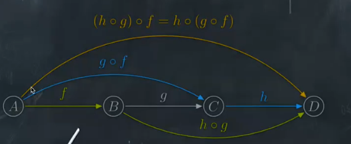
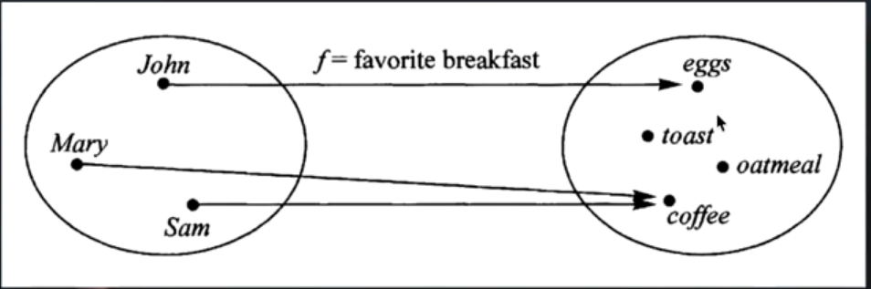

# 函数式编程


## 目录链接
* [函子的实现与概念 ](./函子/README.md)
* [point_free编程风格](./point_free/README.md)
* [理解函子的实现](./函子/README.md)
* [递归、尾递归、尾递归优化与爆栈](./递归与爆栈/README.md)
* [函数式编程第三方库](./第三方库/README.md)


## 范畴论
苦涩难懂， 并没有完全理解，我的理解： 
态射： 只要两者之间存在某种关系， 就可以进行态射。

笔记: 
1. 函数式编程时范畴论的数学分支是一门很复杂的数学， 认为世界上所有概念体系都可以抽象出一个个范畴

2. 彼此之间存在某种关系概念、 事物、对象等等，  都构成范畴。 任何事物只要找出他们之间的关系， 就能定义

3. 箭头表示范畴成员之间的关系， 正式的名称叫做“态射”(morphism)。范畴论认为， 同一个范畴的所有成员， 就是不同状态的“变形”(transformation)。通过“态射”， 一个成员可以变形成另一个成员。


## 函数式编程的基础理论
用数学的思维去驱动编程
函数式编程中没有`if else`、没有 `switch`, 没有`for`,使用递归代替
1. 函数式编程 ( Functional Programming) 其实相对于计算机的历史而言是一个非常古老的概念， 甚至早于第一台计算机的诞生。 函数式编程的基础模型来源于 `入(Lambda x => x*2)` 演算， 而 `入` 演算并非设计于在计算机上执行， 它是在 20 世纪三十年代引入的一套用于研究函数定义、函数应用和递归的形式系统。

2. 函数式编程不是用函数来编程， 也不是传统的面向过程编程。 主旨在于将复杂的函数符合成简单的函数（计算理论， 或者递归论， 或者兰姆达演算） 。 运算过程尽量携程一系列嵌套的函数调用。

3. Javascript是披着C外衣的Lisp; Lisp是一门纯函数式编程的语言。 但是 JS原本设计值初并没有考虑面向对象， 面向对象是后来应需求加入的， 慢慢的就朝着面向对象走了。

4. 真正的火热是随着React的高阶函数而逐步升温。


## 函数式基本
1. 函数是一等公民。所谓”第一等公民”（first class），指的是函数与其他数据类型一样，处于平等地位，可以赋值给其他变量，也可以作为参数，传入另一个函数，或者作为别的函数的返回值。

2. 不可改变量。在函数式编程中，我们通常理解的变量在函数式编程中也被函数代替了：在函数式编程中变量仅仅代表某个表达式。这里所说的’变量’是不能被修改的。所有的变量只能被赋一次
初值

3. map & reduce他们是最常用的函数式编程的方法。

1.  函数是”第一等公民”
2. 只用”表达式"，不用"语句"
3. 没有”副作用"
4. 不修改状态
5. 引用透明（函数运行只靠参数）

## 专业术语

* 纯函数
* 函数柯里化
* 函数组合
* point Free
* 声明式与命令式代码
* 惰性求值


### 纯函数
对于相同的输入， 永远会得到相同的输出， 而且没有任何可观察的副作用， 也不依赖外部环境的状态。

如果函数返回结果有一定的随机成分那就不算是纯函数

**优点**

可缓存性: 因为纯函数的返回结果根据传入的值是永远一致的， 所以我们可以存储保存结果 ，只需要一次计算， 第二次直接就可以返回， 比如`lodash`的中`_.memorize`方法

**纯度和幂等性**
* 幂等性是指执行无数次后还具有相同的效果，同一的参数运行一次函数应该与连续两次结果一致。幂等性在函数式编程中与纯度相关，但有不一致。
* Math.abs(Math.abs(-42))


### 非纯改为纯
利用函数柯里化， 将一部分固定不变的参数锁住，让有随机性的值或参数放在第二次调用时传入， 以达到类似纯函数的目的


## 函数柯里化
柯里化是一种“预加载”函数的方法，通过传递较少的参数，
得到一个已经记住了这些参数的新函数，某种意义上讲，这是一种
对参数的“缓存”，是一种非常高效的编写函数的方法


## 函数组合
使用纯函数和柯里化会经常写成洋葱圈的样子`f(g(a(x)))` 类似这样。
为了避免函数的重复嵌套, 我们需要使用`函数组合`的方式

就是类似于搭积木， 提供一个拼接函数， 构建好组合的模式， 然后根据用户传入参数
```
function composer(a, b) {
  return a(b())
}
// 自由传入你的函数， 可以调换顺序， 拼接模式已被预设
console.log(composer((x) => 3 + x, ()=> 1))
```

使用函数组合会使代码更灵活
这就涉及到数学中的组合问题



## 声明式与命令式代码
命令式代码的意思就是，我们通过编写一条又一条指令去让计算机执行一些动作，这其中一般都会涉及到很多繁杂的细节。而声明式就要优雅很多了，我们通过写表达式的方式来声明我们想干什么，而不是通过一步一步的指示。

```
//命令式
let CEOs = [];
for(var i = 0; i < companies.length; i++)
CEOs.push(companies[i].CEO)
}
//声明式
let CEOs = companies.map(c => c.CEO);
```


## 惰性求值、惰性函数、惰性链
惰性其实就是延迟的一次， 让函数在当他用到的时候再去执行， 

惰性函数呢一般用在规避重复的浏览器能力检测， 因为这个特性只需要排查一次就知道结果了， 重复的去排查性能未免太差

惰性链的大致实现就是，先暂时存储方法， 不去执行， 等到调用执行方法时再统一执行


## 偏函数和偏应用函数
* 偏函数是一种数学概念
* 偏应用函数是实际应用中的一些东西， 比如：函数柯里化


偏函数通熟易懂的讲就是单个参数的函数

为什么叫偏 ， 因为一个函数只能处理一个逻辑， 比如 Bind

> 偏函数用法是指创建一个 调用另一个部分——参数或变量已经预置的的函数 的函数的用法


一个函数通过预先填充原始的部分创建一个新函数

柯里化就是偏函数的一个应用


**偏应用函数**

俗一点就是说传入你要执行的回调和参数， 然后函数内部再把他们拼接, 然后返回一个只需要传入一个参数的函数

```
// 带一个函数参数 和 该函数的部分参数
const partial = (f, ...args) => 
  (...moreArgs) => f(...args, ...moreArgs)

const add3 = (a,b, c) => a + b + c
// 偏应用 `2` 和 `3` 到 `add3` 给你一个单参数的函数

const fivePlus = partial(add3, 2, 3)
fivePlus(4)

// bind 可以实现函数柯里化
const add1More = add3.bind(null, 2, 3)

```


## 函数式编程专业术语
* 高阶函数
* 尾调用优化
* 闭包
* 容器、Functor
* 错误处理、Either、AP
* IO
* Monad


## 高阶函数
* 它是一等公民
* 它已一个函数作为参数
* 已一个函数作为返回结果

高阶函数就是对已封装的函数再进行一次封装， 然后返回这个函数， 达到更高程度的抽象


## 范畴与容器
1. 我们可以把”范畴”想象成是一个容器，里面包含两样东西。值（value）、值的变形关系，也就是函数。

2. 范畴论使用函数，表达范畴之间的关系。

3. 伴随着范畴论的发展，就发展出一整套函数的运算方法。这套方法起初只用于数学运算，后来有人将它在计算机上实现了，就变成了今天的”函数式编程"。

4. 本质上，函数式编程只是范畴论的运算方法，跟数理逻辑、微积分、行列式是同一类东西，都是数学方法，只是碰巧它能用来写程序。为什么函数式编程要求函数必须是纯的，不能有副作用？因为它是一种数学运算，原始目的就是求值，不做其他事情，否则就无法满足函数运算法则了。

## 范畴与容器2
> 容器在有了Map后就成为了函子
1. 函数不仅可以用于同一个范畴之中值的转换，还可以用于将一个范畴转成另一个范畴。这就涉及到了函子（Functor）。
2. 函子是函数式编程里面最重要的数据类型，也是基本的运算单位和功能单位。它首先是一种范畴，也就是说，是一个容器，包含了值和变形关系。比较特殊的是，它的变形关系可以依次作用于每一个值，将当前容器变形成另一个容器。





## 函数式编程的优缺点

**优点**

函数式编程的一个明显的好处就是这种声明式的代码，对于无副作用的纯函数，我们完全可以不考虑函数内部是如何实现的，专注于编写业务代码。优化代码时，目光只需要集中在这些稳定坚固的函数内部即可。

**缺点**

相反，不纯的函数式的代码会产生副作用或者依赖外部系统环境，使用它们的时候总是要考虑这些不干净的副作用。在复杂的系统中，这对于程序员的心智来说是极大的负担。

