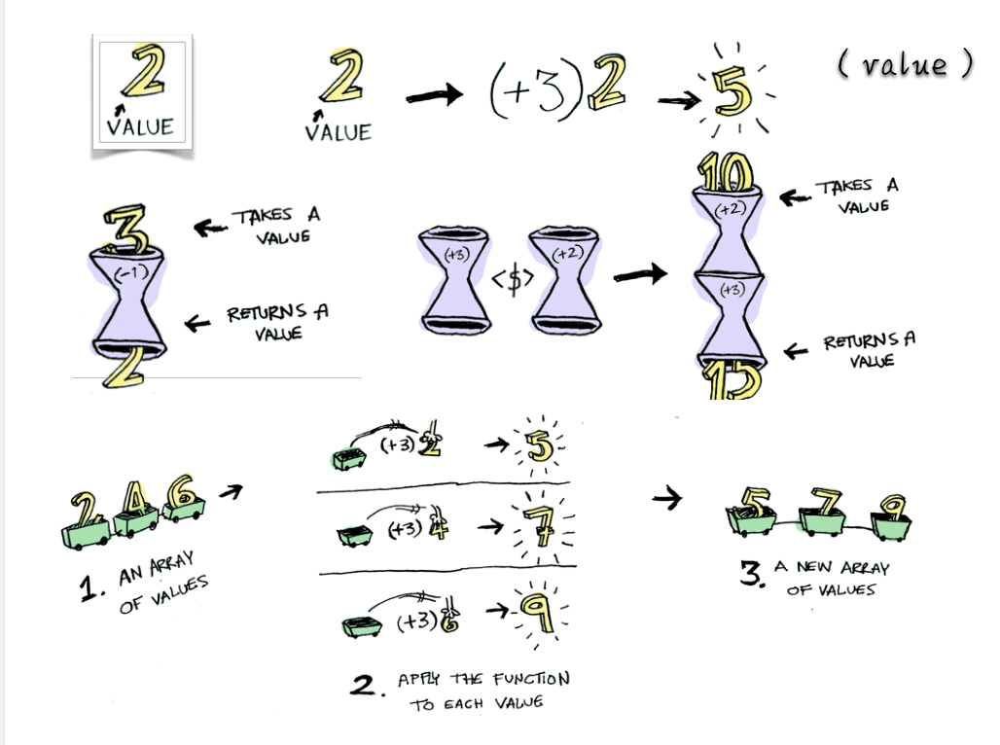

# 容器、Functor（函子）
**ppt笔记**
* $(...) 返回的对象并不是一个原生的 DOM 对象，而是对于原生对象的一种封装，这在某种意义上就是一个“容器”（但它并不函数式）。
* Functor（函子）遵守一些特定规则的容器类型。
* Functor 是一个对于函数调用的抽象，我们赋予容器自己去调用函数的能力。把东西装进一个容器，只留出一个接口 map 给容器外的函数，map 一个函数时，我们让容器自己来运行这个函数，这样容器就可以自由地选择何时何地如何操作这个函数，以致于拥有惰性求值、错误处理、异步调用等等非常牛掰的特性。

**自己的解释**
老袁说面向对象讲究的是父与子的关系， 而函数是编程讲究的是兄弟和兄弟之间的联系， 函子与函子是平级的， 因为语言实现的问题， 所以需要使用到`new` ， 但为了看起来不像面向对象`oo` ，函数式编程约定了一个of方法， 把`new` 操作封装到了of方法里， 传入值就可以返回一个新的函子， 并且map方法也可以态射到另一个函子

以下是代码实现
```
const Container = function(x) {
    this.__value = x;
}

// 函数式编程一般约定， 函子有一个of方法
Container.of = x => new Container(x)
// Container.of('abcd')

// 一般约定， 函子的标志就是容器具有map方法。 该方法将容器里面的每一个值， 映射到另一个容器
Container.prototype.map = function(f) {
    return Container.of(f(this.__value))
}

var temp = Container.of(3)
    .map(x => x + 1)     // => Container(4)
    .map(x => 'Result' + x) // => Container("Result is 4")

console.log(temp)

```


## Maybe 函子
> 函数式编程没有 `if else 和 switch`

函子接受各种函数，处理容器内部的值。这里就有一个问题，容器内部的值可能是一个空值（比如null），而外部函数未必有处理空值的机制，如果传入空值，很可能就会出错。


## 函子的实现
函子的代码实现
1. 任何具有map方法的数据结构，都可以当作函子的实现。
2. Functor（函子）遵守一些特定规则的容器类型。
3. Functor 是一个对于函数调用的抽象，我们赋予容器自己去调用函数的能力。把东西装进一个容器，只留出一个接口map 给容器外的函数，map 一个函数时，我们让容器自己来运行这个函数，这样容器就可以自由地选择何时何地如何操作这个函数，以致于拥有惰性求值、错误处理、异步调用等等非常牛掰的特性。


## map解释
上面代码中，Functor是一个函子，它的map方法接受函数f作为参数，然后返回一个新的函子，里面包含的值是被f处理过的
（f(this.val)）。
   一般约定，函子的标志就是容器具有map方法。该方法将容器里面的每一个值，映射到另一个容器。
上面的例子说明，函数式编程里面的运算，都是通过函子完成，即运算不直接针对值，而是针对这个值的容器----函子。函子本身具有对外接口（map方法），各种函数就是运算符，通过接口
接入容器，引发容器里面的值的变形。
因此，学习函数式编程，实际上就是学习函子的各种运算。由于可以把运算方法封装在函子里面，所以又衍生出各种不同类型的函子，有多少种运算，就有多少种函子。函数式编程就变
成了运用不同的函子，解决实际问题。

**自己的理解**

map 接受一个变形关系， 作用域容器/ 函子里的所有值， 并返回新的函子


## of 方法
你可能注意到了，上面生成新的函子的时候，用了new命令。这实在太不像函数式编程了，因为new命令是
面向对象编程的标志。
函数式编程一般约定，函子有一个of方法，用来生成新的容器。


## 错误处理、Either
**ppt笔记**
1. 我们的容器能做的事情太少了，try/catch/throw 并不是“纯”的，因为它从外部接管了我们的函数，并且在这个函数出错时抛弃了它的返回值。
2. Promise 是可以调用 catch 来集中处理错误的。
3. 事实上 Either 并不只是用来做错误处理的，它表示了逻
辑或，范畴学里的 coproduc

**自己的理解**

try catch 并不是纯的， e的不稳定性， 以及e并不存在于词法作用域上，但是你硬是catch到了一个e， 因此会延长作用域链， 需要一层一层的去找

## Either
**ppt笔记**
条件运算if...else是最常见的运算之一，函数式编程里面，使用 Either 函子表达。
Either 函子内部有两个值：左值（Left）和右值（Right）。右值是正常情况下使用的值，左值是右值不存在时使用的默认值。

**自己的理解**

因为函数式编程没有try catch 这种鬼东西，所以使用 Either 函子， 它里面有 Left 左值， right 右值代替try catch

如果函数运行正确， 那就默认使用右值， 如果函数执行出错， 没有预期， 那就使用左指

让我们来看下 Either函子是如何实现的  

```
class Either extends Functor {
    constructor(left, right) {
        super(left, right)
        this.left = left
        this.right = right
    }
    map(f) {
        // 如果 right 存在， 就对右值进行 回调操作，  如果 right 不存在就对左指进行回调操作， 然后再返回新的 Either 函子
        return this.right ? Either.of(this.left, f(this.right)) : Either.of(f(this.left), this.right)
    }
}
```

## AP函子/因子
**ppt笔记**
1. 函子里面包含的值，完全可能是函数。我们可以想象这样一种情况，一个函子的值是数值，另一个函子的值是函数

**自己的理解**

函子内部的值有可能是函数， 当值是函数的时候我们称为因子

```
class Ap extends Functor {
  ap(F) {
    return Ap.of(this.val(F.val));
  }
}

Ap.of(addTwo).ap(Functor.of(2))
```


## IO
**ppt笔记**
1. 真正的程序总要去接触肮脏的世界。
```
function readLocalStorage(){
  return window.localStorage;
}
```
2. IO 跟前面那几个 Functor 不同的地方在于，**它的 __value 是一个函数**。它把不纯的操作（比如 IO、网络请求、DOM）包裹到一个函数内，从而延迟这个操作的执行。所以我们认为，IO 包含的是被包裹的操作的返回值。
3. IO其实也算是惰性求值。
4. IO负责了调用链积累了很多很多不纯的操作，带来的复杂性和不可维护性


**自己的理解**

有很多操作是理解为脏的并且也是不纯的， 比如 “访问浏览器缓存”、 修改css， 访问数据库， ajax请求等等

将这些脏操作统一同io包裹住，然后延迟执行，也就是包裹了这些操作的返回值，
固定会返回IO函子， 只不过是IO函子内部的值不一样， 返回的IO函子不脏了所以他就变成纯函数了

简单的Io 函子
```
import _ from 'lodash';
var compose = _.flowRight;
var IO = function(f) {
  this.__value = f;
}
IO.of = x => new IO(_ => x);

IO.prototype.map = function(f) {
  // 这里并没有执行这个 this.__value
  return new IO(compose(f, this.__value))
}
```

IO需要 Monad 来执行它的值（也就是脏操作）， 因为脏操作是延迟执行的


```
var fs = require('fs');
var readFile = function(filename) {
  return new IO(function() {
    return fs.readFileSync(filename, 'utf-8');
  });
};
```


## Monad
**ppt笔记**
1. Monad就是一种设计模式，表示将一个运算过程，通过函数拆解成互相连接的多个步骤。你只要提供下一步运算所需的函数，整个运算就会自动进行下去。
2. Promise 就是一种 Monad。
3. Monad 让我们避开了嵌套地狱，可以轻松地进行深度嵌套的函数式编程，比如IO和其它异步任务。
4. 记得让上面的IO集成Monad


**自己的理解**

老袁说Promise就是一种 Monad

可以把monad 理解为拆箱和装箱
我们平时的`1+1` 是纯值相加操作， 但是如果把 `1， 2 ，3` 放进数组里， 然后再挨个相加， 我们就需要把数字从数组中拿出来， 这就是`拆箱`, 然后每个相加完，再挨个放回数组中去， 这就是`装箱`

让我们来看图学习， 图中左下角的`2, 4,6`, 我们把小车看作是数组的下标， 对`2,4,6`进行相加操作就是把他们挨个从车里拿出来， 相加完再放回车里



拆箱和装箱的思想正好可以用在拆解 io 函子上

让我们来看一下 Monad的实现

```
class Monad extends Functor {
    // 返回Functor创建的值， 拆箱
    join() {
        return this.__value
    }
    flatMap(f) {
        // map处理回调， 也就是Map中就接受了脏操作， 然后经过处理，用脏操作返回的值再创建了一个函子后返回， 
        // join方法就是获取脏操作返回的值
        return this.map(f).join()
    }
}
```
注释里我也写了， float接受处理脏操作的回调， 然后将脏操作的返回结果用来再次创建一个函子（因为Map方法会返回函子）， 接着使用Join方法去除脏操作返回的值， 也就是老袁说的， 把处理脏操作的过程送到了外部去执行

然后Io继承自 Monad 函子，用IO进行装箱， 所以就可以使用floatMap方法来进行对脏操作的拆箱处理


可以参考一下这段读取文件的操作
```
readFile('./user.txt')
.flatMap(tail)
.flatMap(print)
// 等同于（这个我不知道是啥， 等老袁仔细说）
readFile('./user.txt')
.chain(tail)
.chain(print)
```