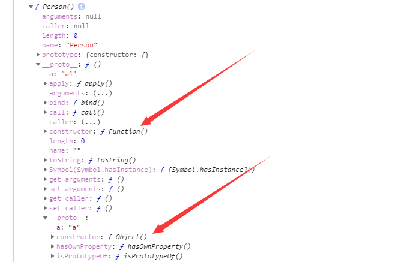
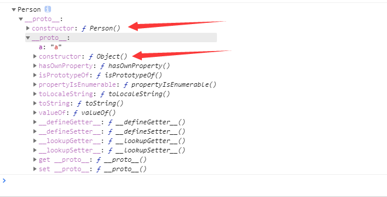
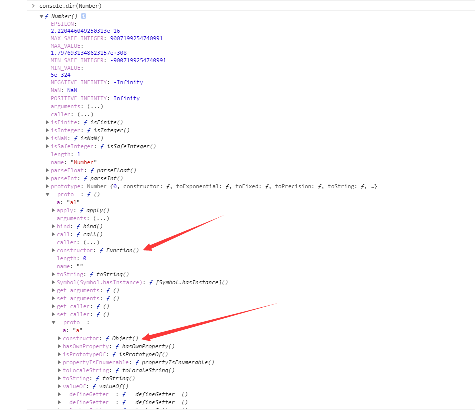
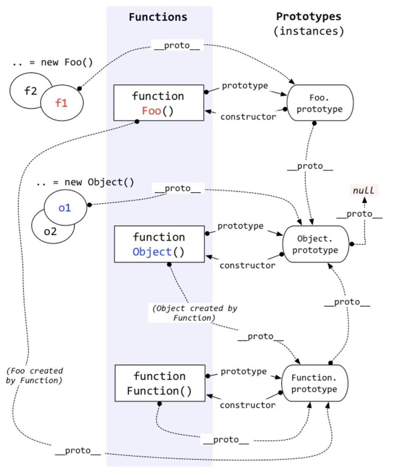

# JS语言特性


## 函数提升
即使在if条件为true 中定义了函数test , 在上方调用时依然为undefed 

```
test()

if(true) {
    function test () {
        console.log('ok')
    }
}

```


## GC回收 与 欺骗词法作用域

先看一下这道问题
### 1. 请问变量a会被GC回收么，为什么呢？

```
function test(){
    var a = "yideng";
    return function(){
        eval("");
    }
}
test()();
```

正确答案是不会回收， 可以进入浏览器的Memory进行搜索查看       
那为什么不会回收呢，  因为当浏览器的eavl执行的时候， 浏览器不知道eval里可能会发生什么      
所以浏览器不敢回收你的变量， 禁止V8对这段代码进行优化

那如何让浏览器回收呢, 需要通过window来调用， 这样会让eval在外部的作用域， 而不是在内部的函数作用域里执行
```
window.eval("")
```


#### 老袁的话
由于ECMAScript规定间接调用eval时，代码将在全局作用域下执行，是无法访问到largeObject变量的。因此对于间接调用eval的情况，各javascript引擎将按标准的方式进行处理，无视该间接调用eval的存在。


### 2. 类似的情况， 我们再来看一道题
```
var s = 1 
function test() {
    var s = 2;
    var f = new Function('console.log(s)')
    f() // 1
}
test()
```


此时我们明明在函数内部定义了 s , 但是通过new 来创建函数时， 得到的却是 s =1 的结果      
因为通过new Function生成的函数对象的外部词法环境是全局环境，而不是包裹它的那个函数的词法环境。所以它不能访问到外层函数(以及外层函数的外层函数)中定义的变量。

换句话说，它的“作用域链”绕过了外层的n层函数，直接链接到了全局作用域。

#### 老袁的话
new Function创建的函数的[[Scope]]是全局的LexicalEnvironment 也无法访问到largeObject 所以会回收


### 3. 再来看这段代码 

```
var s = { name: 'xxx' }
with(s) {
    bb = 30
}
alert(s.bb) // undefined
alert(bb) // 30
```

with 中访问 s 中不存在的变量， 则会在window上创建全局， 如果s上存在则修改对应的值


### Trycatch 延长到全局此法作用域

catch表达式虽然会增加一个LexicalEnvironment，但对闭包内变量的绑定解除算法几乎没有影响，但Error对象的LexicalEnvironment影响 所以不会回收


#### 老袁的话
当有with表达式时，V8将会放弃所有变量的回收，保留LexicalEnvironment中所有变量的绑定。


## 函数原型链
看看这题
```
Object.prototype.a = ‘a';
Function.prototype.a = 'a1';
function Person(){};
var yideng = new Person();
console.log('p.a: '+ yideng.a);  // p.aa
console.log(1..a);   // a
console.log(1.a);
```

首先我们应该知道 1.a 会报错， 比较因为浏览器无法识别你这个 `.` 是给谁的,  所以报了错         
然后第一个答案的输出结果很出人意料，  仔细理一理，

Person.prototype  ->  functon.prototype -> Object.prototype 




yideng -> Person.prototype ->  Object.prototype         



Number.prototype -> Function.prototype -> Object.prototype
因为都是构造函数




经典原型链

