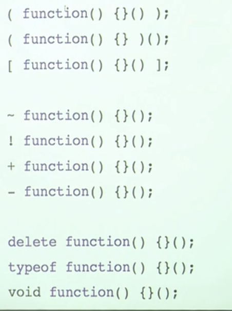

## undefined
> 一个变量声明但未赋值就会赋值默认值 undefined


## const 常量
* 无法修改
* 引用类型可以修改下标, 因为没有修改地址

## arguments
1. 是一个类数组
2. arguments.length 传给函数的参数数目

### reset 写法
> 语义化

```
function fn(...agrs) {
    
}
```

## default 默认参数
```
function test(a=1, b=3) {
    
}
```

# 构造函数
> 构造函数和普通函数并没有区别, 使用`new` 关键字调用就是构造函数, 使用构造函数可以实例化一个对象

## 函数的返回有两种可能
1. 显示调用 return 返回 return 后表达式的求值
2. 没有调用 return 返回 undefined

## 构造函数返回值
1. 没有返回值
2. 简单数据类型
3. 对象类型 ( 如果手动返回对象, 则new 返回这个对象)


## prototype
1. 每个函数都有一个prototype 的对象数学, 对象内部有一个constructor属性, 默认指向函数本身
2. 每个对象都有一个__proto__ 属性, 属性指向其父类型的prototype
3. 所以原型链是这么来的

## 自带属性
* 自带的name 属性, 存储函数的命名空间
* 自带的length, 表示函数接受参数的长度


## 语句与表达式
* console 是基于eval的, 所以不要使用eval测试
* 浏览器能识别成 `表达式` 的就不会识别为`语句`
* 逗号表达式是连续表达式, 他的值是最后一个的值

```
var x = {a: 1 }
{a: 1}
{a: 1, b: 2}
```

## 立即执行函数的思维模式
* 小括号的特性是, 必须包含一个表达式

```
// 小括号报告表达式 返回函数本身, 外部括号执行
(function() {})();

// `( `开头 类似 !开头的写法, 强制将后面转为表达式, 但需要尾括号,所以加 `)`
( function(){}() )

```




# 高阶函数


## 闭包
* 避免变量污染


### 如何用闭包提升性能
* 匿名函数
```
// 经典面试题的 自执行函数
(function(i){
    
})(i);
```

* 惰性函数
> 惰性函数监测特性之类


## 柯里化
> 省调重复传相同参数的过程
```
var isNumber = isType('Number')
```

## 尾递归
1. 尾调用是指某个函数的最后一步是调用另一个函数
2. 函数调用自身, 称为递归
3. 如果尾调用自身, 就称为尾递归

## 反柯里化
```
Function.prototype.uncurry = function() {
    return this.call.bind(this)
}

var push = Array.prototype.push.uncurry()

var arr = []

push(arr, 1)
push(arr, 2)
push(arr, 3)


```