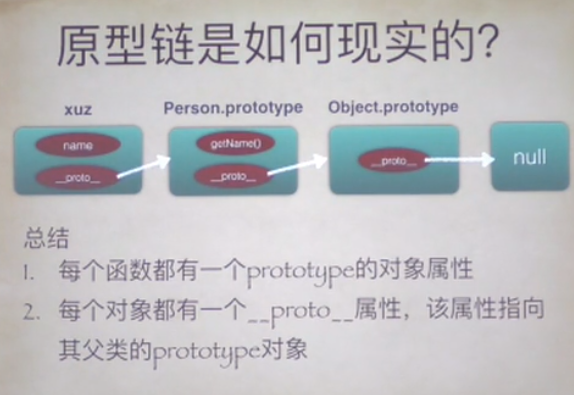
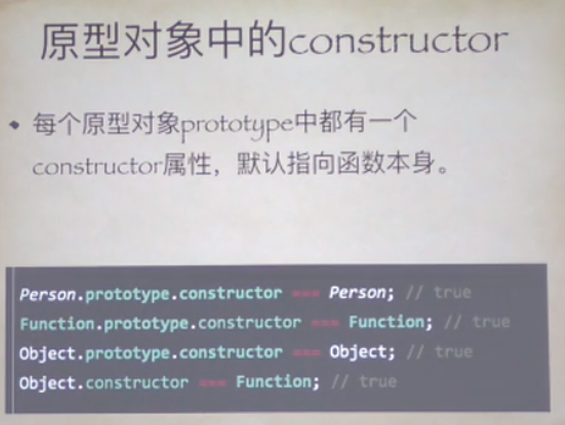

## 小测试题
> 答案在笔记最下方

### 一:
```
if(!("userName") in window ) {
    var userName = "nixiaolei"
}
console.log(userName)
```

### 二:
```
var obj = {
    user: "nixiaolei",
    getName: function( ){
        return this.user
    }
}
var getNameFn = obj.getName
console.log(getNameFn())
console.log(obj.getName())
```
### 三: 
```
var name = 'global'
function A(name) {
    alert(name)
    this.name = name 
    var name = '1'
}

A.prototype.name ='2'
var a = new A('3')
alert(a.name)
delete a.name
alert(a.name)

```
### 四:
```
function fun(n, o) {
    console.log(o)
    return {
        fun(m) {
            return fun(m, n)
        }
    }
}

var a = fun(0);
a.fun(1);
a.fun(2)
var b = fun(0).fun(1).fun(2).fun(3);
var c = fun(0).fun(1);

c.fun(2);
c.fun(3);
```


## 作用域
> 作用域有大到小

* 程序级
* 文件级
* 函数级
* 块级

### javaScript中的作用域
* 全局作用域
* 函数作用域
* 块级作用域(ES6)

### 函数参数与`var`
* 函数参数也是函数的局部变量        
* var 的声明前置并不会使被声明的函数参数无效, 两个是同样的
* 函数参数要比var 先声明


### 作用域链


### this
* 普通函数中:
    * 严格模式: undefined
    * 非严格模式: 全局对象(window)
* 构造函数中: 对象实例
* 对象方法: 对象本身


## 原型链




### 为什么Object.constructor 是Function
> 因为Object 实际上也是一个构造函数, 可以在console 里打印一下, 返回的是native Code  原生函数, 所以 可以进行`new Object`


### 闭包的内存泄漏
> IE的循环引用导致计数垃圾回收机制内存泄漏       

* 内存泄漏主要是人为造成的
* 利大于弊


## 答案
### 一:
* undefined

### 二: 
* undefined           
* nixiaolei

### 三:
* 3
* 3
* 2