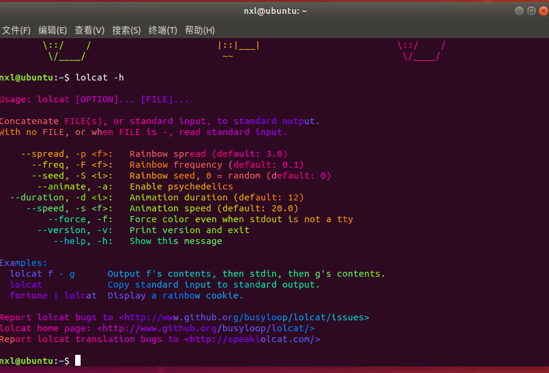
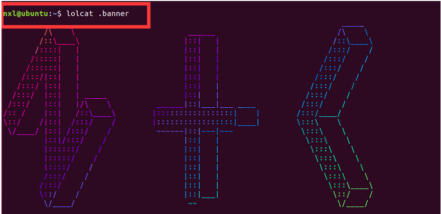

## 一、彩虹终端 lolcat
### 1. 安装
> sudo apt-get install lolcat

### 2. 尝试下， 查看帮助
> lolcat -h




### 3. 打开本地文件
> lolcat 文件名

比如 :




## 二 、 终端自动启动
### 1. 进入用户目录
> cd ~

### 2. 创建隐藏文件， 里面放你要的字符

创建隐藏文件
> touch .banner 

编辑隐藏文件
> gedit .banner


### 3. 设置终端启动命令
```
echo ' 你的命令 ' >> ~/.bashrc
```

比如:
```
echo 'lolcat .banner ' >> ~/.bashrc
```

### 4. 重启终端看看