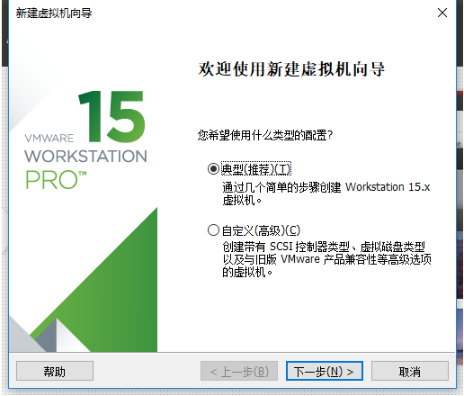
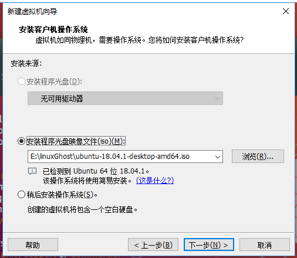
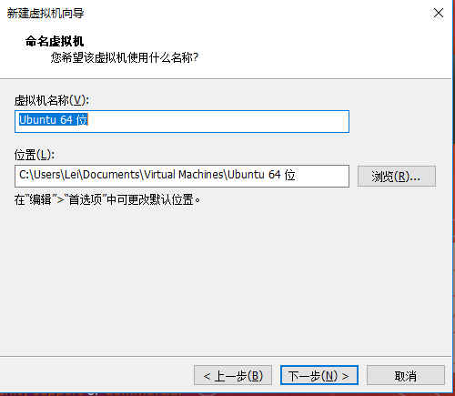
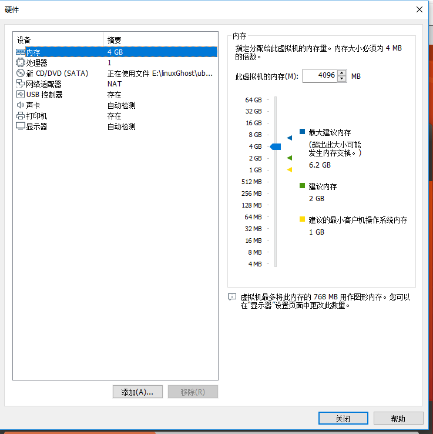

# 如何在虚拟机安装Ubuntu

## 下载安装VMware
1. 进入VMware官网  https://www.vmware.com/cn.html
2. 找到下载, window 选择用户下载 `Workstation Pro`
3. 过程中需要登录
4. 安装

## 下载Ubuntu
> ubuntu 一年更新两次, 一次在4月, 一次在10月
1. 进入官网 https://www.ubuntu.com/download/desktop
2. 找到download ,选择带 LTS的长期支持版本
3. 下载

## 创建虚拟机安装Ubuntu
1. 进入VMware ,点击创建新建虚拟机
2. 选择 "典型" 

2. 选择下载好的Ubuntu镜像

3. 随便输入点基本信息

4. 虚拟机名称及安装位置

5.磁盘大小及文件拆分格式( 建议单文件, 速度更快 )

6. 点击自定义硬件

7. 调整内存大小, 建议4GB

8. 调整处理器核数( 至少2核 ) , 然后点击关闭

9. 点击完成, 等待系统安装结束

