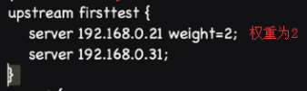

## 什么是反向代理
正向代理就是， 你在国内的网络， 你想上谷歌， 但是你没有办法出去， 如果你想上网那你必须要翻墙， 但是你朋友的电脑可以访问外网， 那你先访问你朋友的电脑， 然后你朋友帮你访问谷歌再返回给你， 这样的操作来达到访问谷歌的目的就叫代理 

反向代理就是， 相当于门卫， 内网有许多服务器你无法直接访问， 必须通过门卫允许， 然后门卫递交你的信息找到相应的部门

## 什么是负载均衡
服务器都有自身的负载上限， 所以公司的服务器一般都是集群， 也就是多个小服务器组成， 然后当外部请求进入时， 为了不让某一台服务器压力过大， 超过承受能力使其崩溃， 我们就需要平均分配外部的请求给集群中的各个服务器，分配给压力最小的服务器 ， 这就是负载均衡

## Nginx的负载均衡实现
Nginx 使一款可以通过反响代理实现负载均衡的服务器，使用Nginx 服务实现负载均衡的时候， 用户的访问首先会访问到Nginx服务器， 然后Nginx服务器再从服务器集群表中选择压力较小的服务器， 然后将该访问请求引向该服务器。若服务器集群中的某个服务器崩溃， 那么从待选服务器列表中将该服务器删除，也就是说一个服务器如果崩溃了， 那么Nginx就肯定不会将访问请求引入服务器了。

## HTTP Upstream模块
Upstream 模块是Nginx服务器的一个重要模块。 Upstream模块实现在轮询和客户端Ip之间实现后端的负载均衡。 常用的指令Ip_hash指令、 server指令和Upstream指令

> 轮询就是在类似这样的你的服务器列表中不断查找优先使用的服务器， 以及排除已崩溃的服务器

* 什么是HTTP Upstream 模块
* ip_hash指令
* server 指令

### ip_hash 指令
既然是反响代理， 我们需要规避一种情况，当用户第一次进入时， 给该用户分配了 a 服务器， 然后用户刷新页面重新分配了 b 服务器， 那用户的操作信息就丢失了， 这是非常不友好的体验

ip_hash的存在正是为了解决这个问题， 根据每个进入的请求生成hash,  刷新页面还是重新进入上次的那台服务器

### server 指令
如果在你知道某台服务器配置比较好， 性能比较高的情况下， 想让其做更多的事情， 那么我们可以给这台机器设置一个较高的权重， 这样负载均衡就会将更多的权重分配到这台高性能的机器， 默认的权重比例是 `1:1:1`, 

比例怎么看呢， 比如你有两台服务器， 权重比例是`2: 1` , 那么请求落到第一台服务器的几率是 `2/3` ， 请求落到第二台服务器的几率是 `1 / 3`

### Upstream指令
Upstream指令主要是用于设置一组何以在proxy_pass和fastcgi-pass指令中使用额外代理服务器， 默认负载均衡方式为轮询

## 其他方式实现负载均衡
不同实现方式的优缺点: 加入使用硬件的方式实现负载均衡， 那么中间的转发机构就是硬件， 这个时候运行效率非常高， 但是对应的成本也非常高。 如果我们采用软件的方法来实现负载均衡， 那么中间的转发机构就是软件， 这个时候， 运行效率不如硬件， 但是成本相对来说低很多。 而使用Nginx服务器实现负载均衡， 那么就是通过软件的方式来实现负载均衡， 并且Nginx 本身支持高并发等。 故而使用Nginx服务器实现负载均衡， 能大大节约企业的成本， 并且由于Nginx是服务器软件， 其执行效率也是非常高。