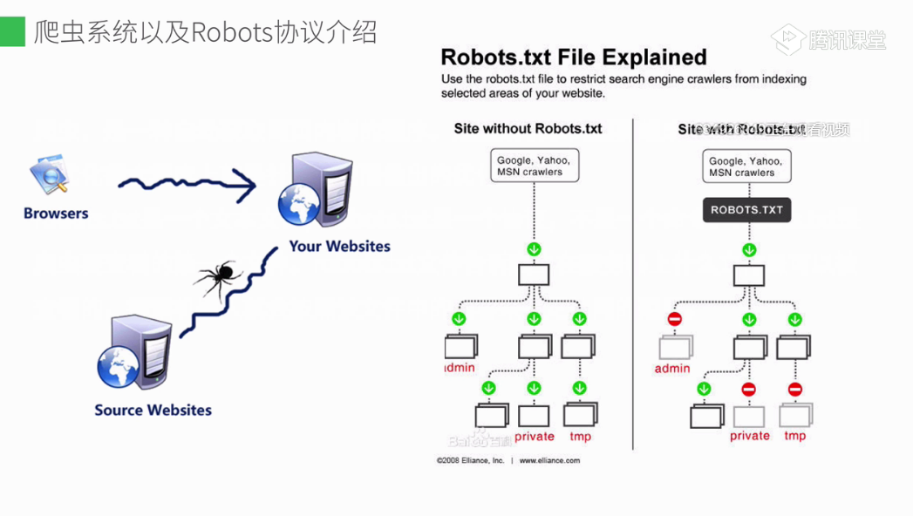

# 爬虫与ROBOTS协议

爬虫， 是一种抓取网页内容的程序。 是搜索引擎的重要组成部分，因此搜索引擎优化很大程度上就是针对爬虫而做出的优化

robots.txt 是一个文本文件， robots.txt 是一个协议， 不是一个命令。 robots.txt 是爬虫要查看的第一个文件。 robots.txt 文件告诉爬虫在服务器上什么文件是可以被查看的， 搜索机器人就会按照改文件中的内容来确定访问的范围

## 爬虫
爬虫回根据robots协议确定搜索范围， 左边就是无限制的网站， 所有页面都放行，  绿色畅通， 右边的网站限制了爬虫的搜索范围，因此部分网页被标红了， 爬虫遵循了robots 协议

有时候，  我们ajax请求过来的页面并不是完整的html页面， 我们只能获取该网页首次渲染的， 而现在的网站大部分是通过ajax后续加载的内容，所以造成了网页seo的优化问题。

