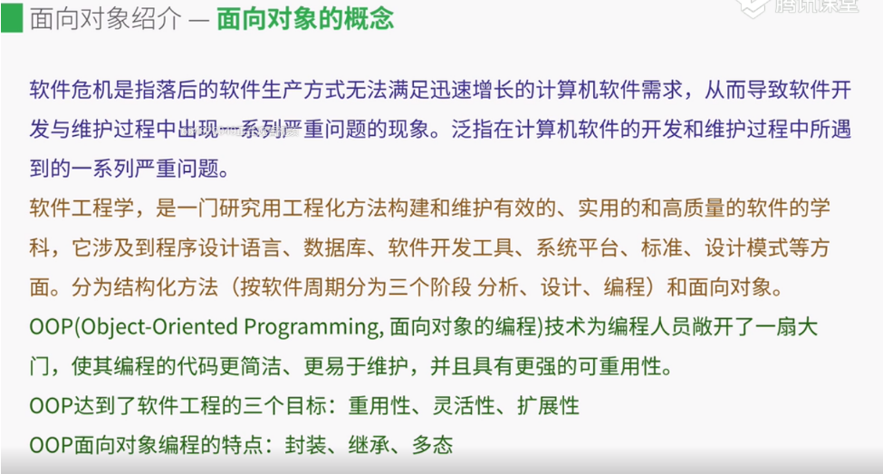
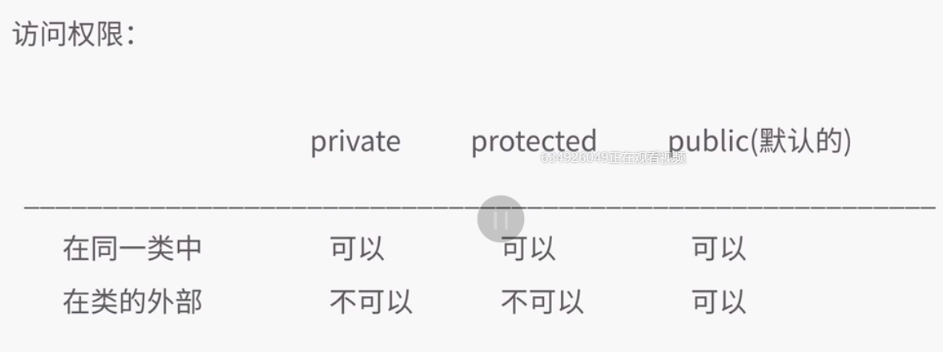
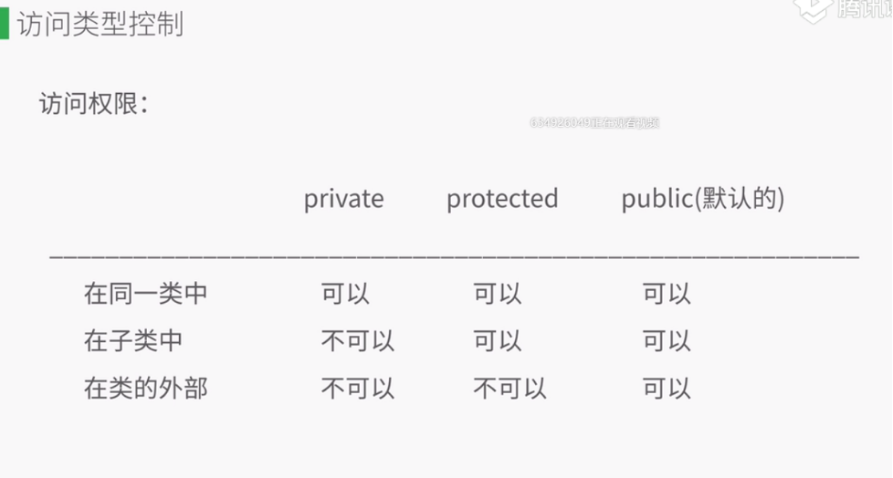
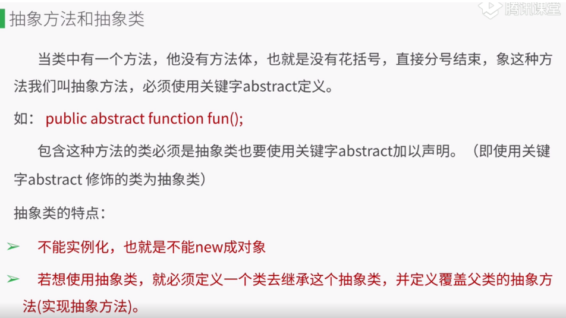
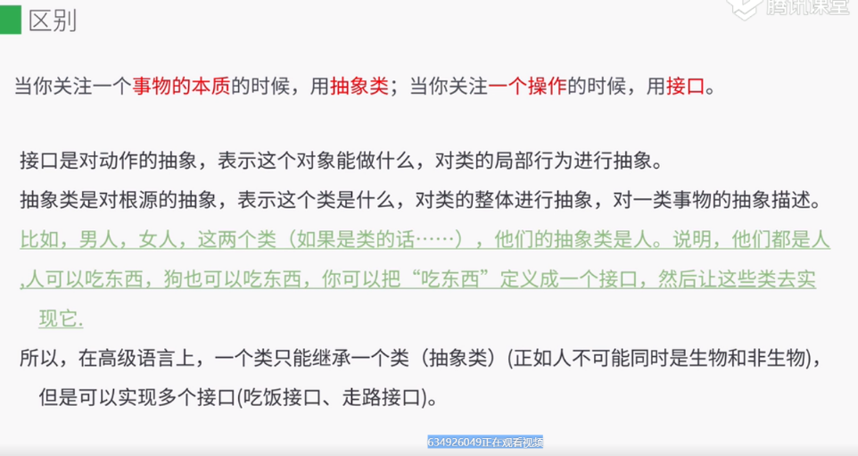
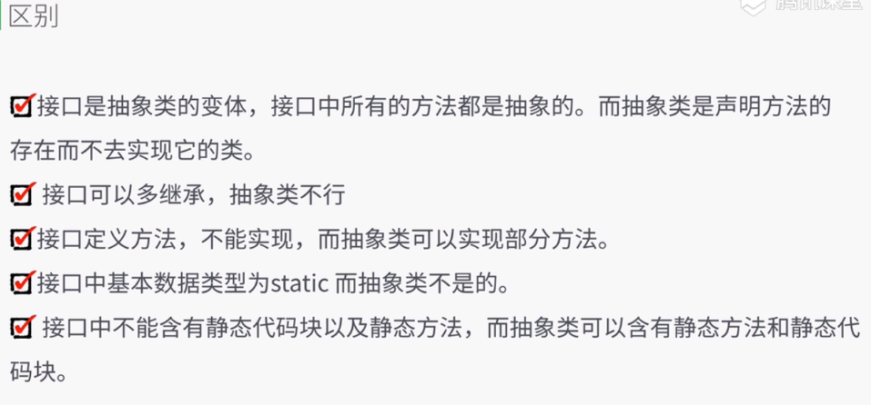

# 面向对象

软件危机是指落后的软件生产方式无法满足迅速增长的计算机软件需求， 从而导致软件开发与维护过程中出现一系列严重问题的现象。 泛指在计算机软件的开发和维护过程中所遇到的一系列严重问题。

软件工程学， 是一门研究用工程化方法构建和维护有效的、实用的和高质量的软件的学科， 它涉及到程序设计语言、 数据库、 软件开发、 系统平台、 标准、 设计模式等方面。分为结构化方法（ 按软件周期分为三个阶段 分析、 设计、 编程 ） 和面向对象。

OOP( Obejct-Oriented Programming, 面向对象编程 ) 技术为编程人员敞开了一扇大门， 使其编程的代码更简洁、 更易于维护， 并具有更强的可重用性。
OOP达到了软件的三个目的： 重用性、 灵活性、 扩展性
OOP面向对象编程的特点： 封装、继承、 多态





## 特性
* 对象的行为
* 对象的状态
* 对象的标识


## 如何实现一个类
* 类的声明
* 成员属性
* 成员方法

```
<?php 
// 类的声明
class Person {
    public $age;
    public function say($word) {
        echo "she say {$word}";
    }

    public function info() {
        $this -> say('Hi');
        return $this -> age;
    }
}


$xiaohong = new Person();
$xiaohong -> age = 22;
$xiaohong -> info();
$age = $xiaohong -> info();


?> 
```


## 构造方法 和 析构方法
> 构造方法: 实例创建时被调用的方法, 也是实例化对象时接收参数的方法
* 析构方法: 实例被销毁时或者后续无代码执行时 会被调用
```
// 构造方法 和 析构方法
class Person {
    // 构造方法
    public function __construct($name, $age) {
        // 当这个类new 的时候自动执行
        $this -> age = $age;
        $this -> name = $name;
    }

    public function data() {
        return $this -> age;
    }
    
    // 析构方法
    // 可以进行资源的释放操作  数据库关闭等等
    public function __destruct() {
        // 对象被销毁的时候执行  || 没有代码再去执行
        echo "拜拜 {$this -> name}";
    }

}
```

## 魔术方法
* __set() 设置时调用 ( 只对私有变量生效 )
* __get() 读取时调用
* __isset() 在外部对类中属性isSet判断时调用
* __unset() 从类中释放变量时调用 , 使用unset时调用

### __set
```
class Person {
    public $name = "nxl"; // 公共的
    private $age = 18; // 私有的 类外部无法访问
    protected $money = 10; // 受保护的 ( 不能在类的外部访问 )
    
    private function getName() {
        return $this -> age;
    }

    protected function getMoney() {
        return $this -> money;
    }

    public function userCard() {
        echo $this -> getAge().$this -> getMoney();
    }
    
    
    public function __set($key, $value) {
        if($key == 'name' && $value == 'laowang' ) {
            $this -> name = "xiaowang";
        }
    }
    
    public function __isset($key) {
        if($key == 'age') {
            return "private age";
        }
    }
}
$xw = new Person();
// echo $xw -> getMoney();

echo isset($xw -> age)

```




## 继承与重载
> 重载就是相同的函数根据传入不同的参数执行不同的结果
```
    class Person {
        public $name;
        private $age;
        // 可继承但无法被外部访问
        protected $money;

        public function __construct($name, $age, $money) {
            $this -> name = $name;
            $this -> age = $age;
            $this -> money = $money;
        }
    }


    class Man extends Person{
        public function __construct($name, $age, $money) { 
            // 如果没调用父类的构造方法 , 这个就是重写
            // 调用了才是重载
            parent::__construct($name, $age, $money);
        }
        public function getMoney() {
            return $this -> money;
        }
    }

    $s = new Man('xiuwang', 10, 200);
    echo ($s -> getMoney());


```



## 多态
> 指在父类中定义的属性或行为被子类继承后, 可以具有不同的数据类型或表现出不同的行为. 这使得同一个属性或行为在父类及其各个子类中具有不同的语义.


## 抽象方法和抽象类
*  含有抽象方法的类必须是抽象类
*  抽象类不一定非得含有抽象方法
*  抽象类可以含有普通方法
*  抽象类不能被实例化 必须由一个子类去继承 并且吧抽象类的抽象方法都实现
```
<?php
    // 抽象类

    //  含有抽象方法的类必须是抽象类
    //  抽象类不一定非得含有抽象方法
    //  抽象类可以含有普通方法
    //  抽象类不能被实例化 必须由一个子类去继承 并且吧抽象类的抽象方法都实现
    abstract class Person {
        // 抽象方法 没有方法体
        public abstract function eat();
    }


    class Man extends Person {
        public function eat() {
            echo "Man eat";
        }
    }

    $man = new Man();
    $man -> eat();
?>
```


当类中有一个方法， 他没有方法体， 也就是没有花括号， 直接分号结束， 像这种方法我们叫抽象方法， 必须使用关键字 abstract定义。

如: `public abstract function fun()`

包含这种方法的类必须是抽象类也要使用关键字abstract加以声明。 （ 即使用关键字abstract修饰的类为抽象类 ）

抽象类的特点：
* 不能实例化， 也就是不能new成对象
* 若想使用抽象类，就必须定义一个类去继承这个抽象类， 并定义覆盖父类的抽象方法（实现抽象方法）





### 区别

当你关注一个事件的本质的时候， 用抽象类；当你关注一个操作的时候， 用接口。

接口时对动作的抽象， 表示这个对象能做什么， 对类的局部行为进行抽象。
抽象类时对根源的抽象， 表示这个类时什么， 对类的整体进行抽象， 对一类事物的抽象描述。
> 比如， 男人， 女人， 这两个类（ 如果是类的话…… ）， 他们的抽象是人。 说明， 他们都是人人可以吃的东西， 狗可以吃东西， 你可以把“吃东西” 定义成一个接口， 然后让这些类去实现它


所以， 在高级语言上， 一个类只能继承一个类（抽象类）（正如人不可能同时是生物和非生物）， 但是可以实现多个接口（ 吃饭接口、 走路接口 ）。



* 接口是抽象类的变体，接口中所有方法都是抽象的。 而抽象类是声明方法的存在而不去实现它的类。
* 接口可以多继承， 抽象类不行
* 接口定义方法， 不能实现， 而抽象类可以实现部分方法。
* 接口中基本数据类型为static而抽象类不是的。
* 接口中不能含有静态代码块以及静态方法， 而抽象类可以含有静态方法和静态代码块





## 接口 
* 接口声明的关键字时Interface
* 接口剋声明常量也可以抽象方法
* 接口中的方法都是抽象方法 用abstract 去手动定义
* 接口不能被实例化 需要一个类去实现它
* 一个类不能继承多个类 一个类可以实现多个接口

```
<?php
// 接口声明的关键字时Interface
// 接口剋声明常量也可以抽象方法
// 接口中的方法都是抽象方法 用abstract 去手动定义
// 接口不能被实例化 需要一个类去实现它
// 一个类不能继承多个类 一个类可以实现多个接口
interface Person{
    // 常量
    const NAME = "xiaowang";
    public function run();
    public function eat();
}


interface Study {
    public function study();
}

class Student implements Person,Study {
    public function run() {
        echo 'run';
    }
    public function eat() {
        echo 'eat';
    }
    public function study() {
        echo "study";
    }
}

$xw = new Student();
// $xw -> eat()
echo $xw::NAME;

?>
```

### 常量

> 定义
```
interface Person{
    // 常量
    const NAME = "xiaowang";
}
```

> 调用
```
class Student implements Person {
}
$xw = new Student();
echo $xw::NAME;
// 或者 不New 直接访问
Student::NAME;
```