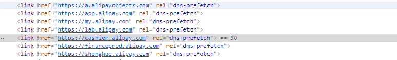

# 雅虎军规

* 优秀博客: https://blog.csdn.net/camel20/article/details/7283893


***


## 减少请求
 适当减少Js 、 CSS的网络请求次数， 尽量合并js 和css文件
## DNS 预解析

因为DNS解析的速度是导致资源或者页面跳转的很大原因，  所以体检解析好DNS会有效的提升后续资源的访问速度



## 避免跳转
尽可能的避免 `301`、`302`的重定向跳转


## 可缓存的AJAX
> 需要服务端配合

要提高性能，优化这些Ajax响应至关重要。最重要的提高Ajax性能的方法就是让响应变得可缓存，就像在添上Expires或者Cache-Control HTTP头中讨论的一样。下面适用于Ajax的其它规则：
* Gzip组件
* 减少DNS查找
* 压缩JavaScript
* 避免重定向
* 配置ETags

> 我们一起看看例子，一个Web 2.0的电子邮件客户端用了Ajax来下载用户的通讯录，以便实现自动完成功能。如果用户从上一次使用之后再没有修改过她的通讯录，而且Ajax响应是可缓存的，有尚未过期的Expires或者Cache-Control HTTP头，那么之前的通讯录就可以从缓存中读出。必须通知浏览器，应该继续使用之前缓存的通讯录响应，还是去请求一个新的。可以通过给通讯录的Ajax URL里添加一个表明用户通讯录最后修改时间的时间戳来实现，例如&t=1190241612。如果通讯录从上一次下载之后再没有被修改过，时间戳不变，通讯录就将从浏览器缓存中直接读出，从而避免一次额外的HTTP往返消耗。如果用户已经修改了通讯录，时间戳也可以确保新的URL不会匹配缓存的响应，浏览器将请求新的通讯录条目。


## 推迟加载内容
如: 瀑布流的无限加载

## 资源预加载
```
<!-- 预加载整个页面 --> 
<link rel="prefetch" href="http://www.webhek.com/misc/3d-album/" /> 
<!-- 预加载一个图片 --> 
<link rel="prefetch" href=" http://www.webhek.com/wordpress/ wp-content/uploads/2014/04/b-334x193.jpg " />
```