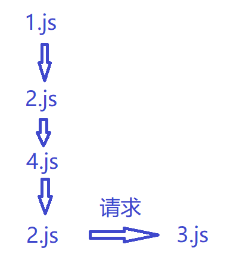
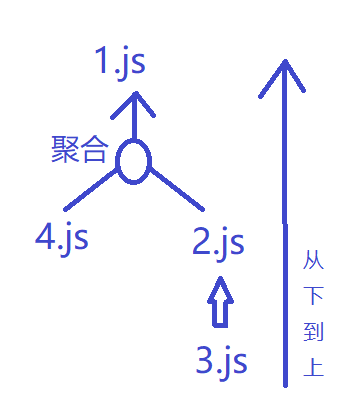

# 前端模块化
1. 前端模块化框架肩负着模块管理、 资源加载两项重要的功能， 这两项功能与工具、性能、业务、 部署等工程环节都有着非常紧密的联系。 因此， 模块化框架的设计应该最高优先级考虑工程需要。
2. ConmmonJS API定义很多普通应用程序 （主要指非浏览器的应用 ） 使用的API， 从而填补了这个空白。 它的终极目标就是提供一个类似Python 、Ruby和Java的标准库。
3. 根据这个规范， 每个文件就是一个模块， 有自己的作用域。 在一个文件里面定义的变量、函数、类，都是私有的， 对其他文件不可见。
4. CMD和AMD都是CommonJS的一种规范的实现定义， RequireJS和SeaJS都是对应的实践。 还有一种兼容cmd和 amd的模式叫umd


**关于CommonJs为什么不适合浏览器端**
因为CommonJS的 `require`是同步加载， 并且是复制模块的方式， 所以让浏览器去同步加载模块显然有点不太合理， 但对后端服务来说却不一样，有充足的时间去加载本地文件 ， 而浏览器端遵守的`EcmaScript`标准的import 遵循的是 关系引用加载


## AMD / CMD
* AMD 推崇**依赖前置**， 是 RequireJS 在推广过程中对模块定义的规范化产出。
* CMD 推崇**依赖就近**， 是 SeaJS 在推广过程中对模块定义的规范化产出。


但是尴尬的是， 在浏览器端实际实现的过程中， 依旧需要提前加载好所有模块， 否则等到用到的时候再去加载不就要阻塞了吗


**样例代码**
```
//AMD(Asynchronous Module Definition)
define(['dep1','dep2'],function(dep1,dep2){
  //内部只能使⽤用指定的模块
  return function(){};
});
//CMD
define(function(require,exports,module){
  //此处如果需要加载某XX模块，可以引⼊入
  var xx=require(‘XX’);
});

```
## 执行顺序
根据书写习惯的的不一样， cmd和amd 的模块执行顺序也不尽相同， 但是大致模块加载原理是一样的

amd 倒着来的原因是， 如果不先把最内部的依赖先执行完， 后面没法接着执行

* AMD： 3.js，2.js，1.js，，，即如果模块以及该模块的依赖都加载完了，那么就执行。。。 比如 3.js 加载完后，发现自己也没有依赖啊，那么直接执行3.js的回调了，，2.js加载完后探查到依赖的3.js也加载完了，那么2.js就执行自己的回调了。 主模块一定在最后执行

* CMD： 1.js，2.js，3.js，，，即先执行主模块1.js，碰到require('2.js')就执行2.js，2.js中碰到require('3.js')就执行3.js


## 加载顺序及原理
如果你的结构是这样的: 网页引用了`1.js` , 然后` 1.js`引用 `2.js`和`4.js` , `2.js` 引用 `3.js`, 大致结构就是这样:

* 1.js
  * 2.js
    * 3.js
  * 4.js


### 原理
模块化的原理也就是创建了使用 `script` 标签， 使用`src`去载入对应的js文件,  用`load`或`onreadystatechange`事件监听请求完成  ,像`amd`这种依赖前置的模块就比较清晰， 所以只需要按填写的请求即可，  但是因为 `cmd` 是推崇的依赖就近， 所以它需要使用正则去解析文档， 找出`require`的依赖， 所以也就造成了被注释了的`require`语句依旧去请求了


### 但是它实际的引用顺序呢？ 


**请求顺序**
`require.js` 的模块加载顺序是先走的`广度优先`， 也就是先请求出`1.js`、 `4.js` ， 等到`2.js`和`4.js`都请求成功了，  然后进入各个文件内部， 进行`深度优先`， 也就是进入`1.js` 找到`2.js` 再找到`3.js`直至没有任何引用后再返回

**看图**

3.js 会在 `2.js` 和 `4.js` 都被请求完成之后去请求




**返回顺序**

框架会监测 js 的加载完成事件， 当最内部的执行完成后， 向上返回， 类似于递归的一个执行流程， 

有这样一种情况， 当`4.js` 请求完成后并且内部依赖也完成， 并不会立马返回给`1.js`, 而是等候其他未完成的依赖， 比如`2.js`还在处理它内部的依赖， 当`4.js`和 `2.js`都完成后， 它会有一个聚合的过程， 统一再返回给 `1.js`


**看图**
