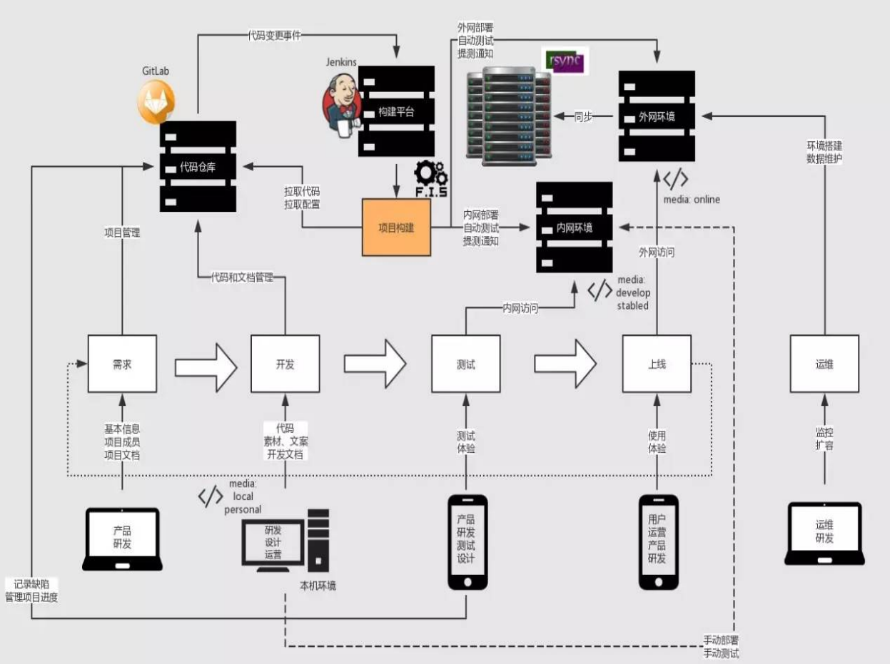

# 前端项目持续集成 

## 为什么需要持续集成
1. 持续集成是通过平台串联各个开发环节， 实现和沉淀工作自动化的方法。
2. 线上代码和代码仓库不同步， 影响迭代和团队协作。
3. 静态资源发布依赖人工，浪费开发人力。
4. 缺少自动化测试，产品质量得不到保障。
5. 文案简单修改上限，需要技术介入。

## CI 持续集成
> continuous integration

在持续集成环境中， 开发人员将会频繁的提交代码到主干。 这些新提交的代码最终合并到主线之前， 都需要通过编译和自动化测试流进行验证。这样做是基于之前持续集成过程中很重视自动化测试验证结果， 以保障所有的提交在合并主干之后的质量问题， 对可能出现的一些问题进行预警。

**自己的描述**

在所有向主分支修改的操作就需要线进行编译和自动化测试的监测， 测试会生成报表， 根据这个报表的结果来决定是否向主分支合并， 如果报表未通过就会被打回来（还会邮件通知领导）， 这样可以防止出现破坏主分支的情况出现

相比于持续交付、 持续部署， 持续集成更与我们前端息息相关， 并且大公司的QA是不受理未通过测试的提交的。

## CD (1) 持续交付
> Continuous Delivery

* 持续交付就是讲我们的应用发布出去的过程。 这个过程可以确保我们尽可能快的实现交付。 这就意味着除了自动化测试， 我们还需要有自动化的发布流， 以及通过一个按钮就可以随时随地实现应用的部署上限。

* 通过持续交付， 您可以决定每天， 每周， 每两周发布一次， 这完全可以根据自己的业务进行设置。

* 但是， 如果您真的希望体验持续交付的优势，就需要先进行小批量的发布， 尽快部署到生产线，以便在出现问题时方便进行故障排除。

**自己的描述** 

在已具备完善的持续集成后， 就可以改善发布过程， 通过一个按钮就进行发布

但是， 如果您真的希望体验持续交付的优势，就需要先进行小批量的发布， 尽快部署到生产线，以便在出现问题时方便进行故障排除。
也就是CI一通过就直接部署上线

## CD (2) 持续部署
> Continuous Deployment

* 如果我们想更加深入一点的话， 就是持续部署了。通过这个方式，任何修改通过了所有已有的工作流就会直接和客户见面。  没有人为干预( 没有一键部署按钮 )， 只有当一个修改在工作流中构建失败才能阻止它部署到产品线。

* 持续部署是很优秀的方式， 可以加速与客户的反馈循环，但是会给团队带来压力， 因为不再有“发布日”了。 开发人员可以专注于构建软件， 他们看到他们的修改在完成工作后的几分钟就上线了。 基本上， 当开发人员在主分支中合并一个提交时， 这个分支将被构建、测试， 如果一切顺利， 则部署到生产环境中。

**自己的描述**

自动实时的部署上限， 是最优的解决办法， 但持续部署的要求是团队非常成熟， 并且上线前是需要经过QA测试的，所以实际情况下很难实现， 一般的团队也很难接收，风险很大

## 开发环节
> 作为持续集成， 这些开发环节一一不可缺少。

首先在项目初级阶段，会拉上我们前端咨询功能的可行性。 商讨完成后UI、UE出设计图， 然后交给开发， 开发马不停蹄的实现， 然后将代码和素材， 开发文档都上传到代码仓库， 一般公司都会使用gitLab, gitLab的hooks钩子挂载到CI服务器平台(如Jenkins)， 然后在CI服务器上编写一些脚本构建项目（如：webpack、fis）， 当代码提交到仓库， CI平台就会监测到， 拉取仓库代码进行打包， 然后运行自动化测试， 并发送提测通知， 将项目发布到内网环境（QA和RD的机器上）， 所以CI平台必须免密登录的权限， 否则无法部署。

## 整个持续集成流程与结构
1. 统一代码仓库通过分支管理合并主干, 如： SVN
2. 自动化构建工具， 编译、部署、测试、监控、本机、开发上线环境。 如： FIS3、Webpack、jdists、package.json、chai、supertest、mocha、selenium-webdriver
3. 持续集成平台。如： Jenkins、Travis CI
4. 部署工具。如：rsync、shelljs、yargs。
5. 运营同学有权限操作运营页面保存即可上限。

## SVN/ GIT版本管理工具使用原则
* 不能随意修改主分支内容( master / Trunk )
* 新分支(branch)应从主分支切出
* 向主分支提交代码前,必须先 拉取最新的主分支代码合至分支（pull && merge）， 并解决冲突
* 向主分支合并时及时的打`Tags` 

### 图形化分支管理平台
* [ `git图形化项目` ](./code/git图形化.md)