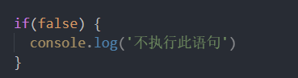

# 流清洗
* gulp-rollup
* rollup-plugin-replace

利用Gulp实现流清洗

原理就是利用`rollup` 优秀的`tree-sharking` 机制， 将没有使用到的代码抖掉

比如这段代码： 



逻辑上永远不会成立， 于是`rollup`就会在打包过程中将其删除， 

但是对于`process.env.NODE_ENV`之类的环境变量却无法做到， 
因为`process.env.NODE_ENV` 只能在入口文件`gulpfile` 中得到，

于是就需要我们在进行`tree-sharking` 之前用已知结果将其替换，
这我们就用到了`rollup-plugin-replace` 插件， 进行替换操作， 如下，将`process.env.NODE_ENV`替换为固定值 "'production'", 所以就出现了之前的 `if(false)`情况， 所以就能成功清洗掉不符合当前环境判断逻辑


```
return gulp.src(entry)
    // transform the files here.
    .pipe(rollup({
      output: {
        format: "cjs"
      },
      // any option supported by Rollup can be set here.
      input: ["./src/server/config/config.js"],
      plugins: [
        rollupReplace({
          // 替换环境变量
          "process.env.NODE_ENV": JSON.stringify('production')
        })
      ]
    }))
    .pipe(gulp.dest('dist'));
```


