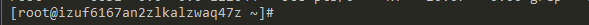
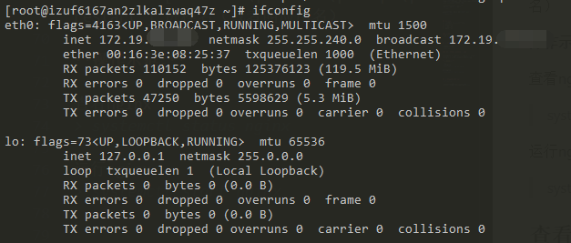
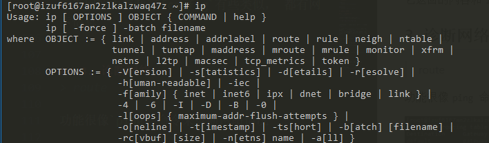
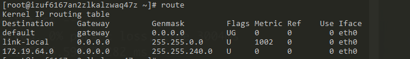
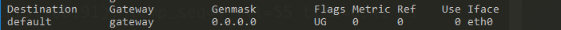

# Linux知识

## 远程连接方式

* window 
  * putty
  * Xshell
  * 在Cmder终端环境下使用ssh命令 （ 推荐 ）
* linux和macOS系统下
  * ssh命令

### ssh命令
> ssh 用户名 @ 服务器地址

如:
> ssh root@192.168.1.1 

登录成功后显示的格式：

它的格式是这样的:
> 登录身份 @ 主机名

## 用户权限与切换身份
> 连接服务器尽可能不要使用root用户 ， 因为万一一不小心操作错了就全没了， 也是为了防止泄漏登录口令

root 用户的权限最大， 其他用户的权限有限，所以操作需要借助`sudo`命令暂时以root身份的权限执行

用户以什么权限身份运行进程， 该进程就会继承什么权限

### 切换身份
切换身份是类似于递归的操作， 所以切换后的身份使用`exit` 命令是退出当前身份， 变为切换前的身份

root用户用`su`命令切换到其他用户是不需要密码的
普通用户用`su`命令切换到`root`用户需要输入密码

## 用户目录
每一个用户在Home目录下都会有一个单独的文件夹， 但root用户比较特殊

root用户的用户目录就是
> /root

普通用户的目录， 比如用户`nxl`: 
> /home/nxl 

## vi/vim 
进入vi后， 会有几种模式：
1. 只读模式
2. 编辑模式
3. 命令模式

### 切换模式
* 敲`i` 或`a` 进入编辑模式

## 服务管理命令

查看所有进程
> systemctl

### 对特定的进程的相关操作

ststemctl [ status \| start \| stop \| restart ] 进程名（或者叫应用名）

**操作示范:** 

查看nginx 
> systemctl status nginx

运行nginx
> systemctl start nginx

# 网络管理命令

## 1. 查看网络接口
> ifconfig

我的阿里云服务器显示的信息如下

上面出现的几个信息大致意思应该如下，现在还不太懂:

* `eth0` 是物理网卡， 这是默认名称， 在有些系统下是个不规则名称
* `lo` 是本地回环地址，不管操作系统有没有配置ip，`lo`是一定会有的， 如果没有说明出问题了

## 2. 网络配置工具箱
> ip

这个是centos > 6 以上才有的新命令

ip 是主命令， 配合其他自命令使用

### 查看网络地址
> ip addr

它返回的内容和`ifconfig`有些类似， 都有网卡信息

## 3. 诊断网络
> route 

功能很像`ping` 命令来诊断网络情况

查看你的默认网关是不是你的路由器， 这也是你上网的配置

### 对应列及含义

* Destination : 路由地址
* Gateway: 网关
* Genmask: 通过网关可以到达的网段，`0.0.0.0` 就是全网段
* Iface: 走得是啥网络接口， `eth0`的话就是物理网卡

如果你又docker 之类的，就会出现很多虚拟网，所以就需要一个默认的配置

# 命令行下载命令

## 1. wget
这个命令是所有linux系统都自带的命令

### 如何使用呢

我们先找到目标文件的下载地址， 然后复制下载地址, 在命令行中输入
> wget    你的目标文件下载地址

### 断点续传

如何防止网络断开， 或者其他原因导致下载中断呢

只要使用`-c`命令开启断点续传模式
> wget -c 你的目标文件下载地址

当不幸断开后， 只需要再输入一次刚才的命令就可以继续之前的下载
> wget -c 你的目标文件下载地址

## 2. curl 
这个功能比较强大一点， 他能控制http头，但是一般`wget`就足够使用了

# 查看帮助
在你需要查看的命令后面使用`--help`查看帮助

比如不明白`wget`怎么用了

> wget --help

## 如何查看更加详细的帮助文档
> man

使用`man`命令查看更加详细的帮助文档， `man`不是男人的意思， 而是`manual`手册的意思

操作方式:
* 空格 ： 向下翻一页
* h : 是`man`本身的帮助
* q: 退出
* 方向键： 逐行移动

# ps命令详解
使用 `ps aux` 命令打印一张当前进程的快照

