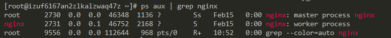

# 进程相关命令
> ps aux | grep nginx

* ps : 进程快照
* top ： 实时进程信息

`ps aux` 和 `top`命令的区别在于， `top`命令是实时刷新的进程详情， 而 `ps`命令是返回一张静态的当前进程快照

## 过滤查询与管道符
> 管道符号: "|"

管道符号的功能就是将前一个命令的返回结果 交给下一个命令

配合我们的grep 命令筛选出需要查看的进程， 如查询Nginx:

> ps aux | grep nginx

## 重要字段含义
* USER: 开启该进程的用户
* pid: 每一个进程都有属于自己的`Pid` , `pid = 1`的进程是用来管理其他进程的进程， 所以它无法被关闭， 一旦该父进程挂了所有子进程也都会挂

## 如何区别主父级进程
一般来说， pid比较小的进程就是父进程

