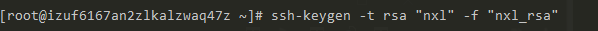

# 远程免密登录

## 免密登录原理
ssh免密登录不代表不验证， 而是使用了证书登录的方式，证书登录

## 加密原理

加密过程
> 明文 -> 密文

解密过程
> 密文 -> 明文

### 对称加密

在此过程中加密方法和解密的方法是一样的，
对密文以加密的方法进行逆运算可以得到明文， 这就叫对称加密


### 非对称加密
> 加密的方法无法用来解密, 加密解密是两种不同的手段

利用质数的原理， 产生两个互质的数，并在此基础上进行一系列的运算， 实现非对称加密， 
> 质数是只能呗 1 和 它本身整除的数

密钥一般是以成对出现的， 公钥加的密只能用私钥去解
* 公钥: 用来加密
* 私钥: 用来解密


## 配置免密登录的步骤
1. 生成密钥对
2. 上传配置公钥
3. 配置本地私钥
4. 免密登录功能的本地配置文件

### 实操
1. 生成密钥对
> ssh-keygen -t rsa -C "你自己的名字" -f "你自己的名字_rsa"

`-t`是`我要加`的意思， `rsa` 是加密算法,  `-C “”` 给你的密钥加入你的痕迹 ，`-f`你输出的这一对密钥文件的文件名（后面带上加密算法的后缀`_rsa`）



敲下回车后，不要输入密码， 输了密码就不是免密登录了，
确认后他会返回一个 图形化的随机数

并且他会在当前目录下生成两个文件
* nxl_rsa 【私钥】
* nxl_rsa.pub 【公钥】

2. 上传配置公钥
* 上传公钥到服务器对应账号的home路径下的.ssh/中
> ssh-copy-id -i "公钥文件名"  用户名@服务器ip或域名

* 配置公钥文件访问权限为 600
> chmod 600 公钥文件名

**查看是否上传成功**

进入你要免密的用户目录下`home/nxl` ,输入
> ls -a

进入`.ssh`， 里面的`authorized_keys`文件就是你传的公钥


3. 配置本地私钥 (之后操作对windows无效)
* 把第一步生成的私钥复制到你的home目录下的.ssh/ 路径下
* 配置你的私钥文件访问权限为 600
* chmod 600 你的私钥文件名

如果你没有配第四步， 免密登录虽然能够使用， 但是你必须告诉`ssh`是以免密登录形式的
> ssh -i 私钥文件的路径 + 文件名   用户名 @ 服务器ip地址

私钥文件路径最好是绝对路径，或者你在私钥目录下执行命令， 只需要 `./文件名` 即可


4. 免密登陆功能的本地配置文件
* 编辑自己home目录的.ssh/ 路径下的config文件（如果config文件不存在则自己创建）
* 配置config文件的访问权限为 644


### 老王的配置
如果你是多主机， 你就把多主机复制过去改改
如果你是单主机，也就是你只有一台服务器， 那就使用单主机就可以了


```
# 多主机配置
Host gateway-produce
HostName IP或绑定的域名
Port 22
Host node-produce
HostName IP或绑定的域名
Port 22
Host java-produce
HostName IP或绑定的域名
Port 22

Host *-produce
User root
IdentityFile ~/.ssh/produce_key_rsa
Protocol 2
Compression yes
ServerAliveInterval 60
ServerAliveCountMax 20
LogLevel INFO

#单主机配置
Host evil-cloud
User root
HostName IP或绑定的域名
IdentityFile ~/.ssh/evilboy_rsa
Protocol 2
Compression yes
ServerAliveInterval 60
ServerAliveCountMax 20
LogLevel INFO

#单主机配置
Host git.yideng.site
User git
IdentityFile ~/.ssh/evilboy_rsa
Protocol 2
Compression yes
ServerAliveInterval 60
ServerAliveCountMax 20
LogLevel INFO

```