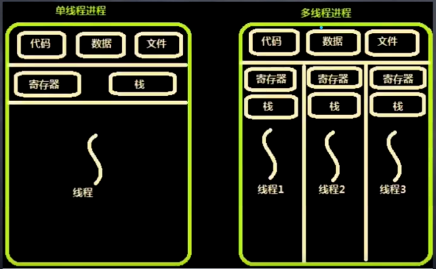
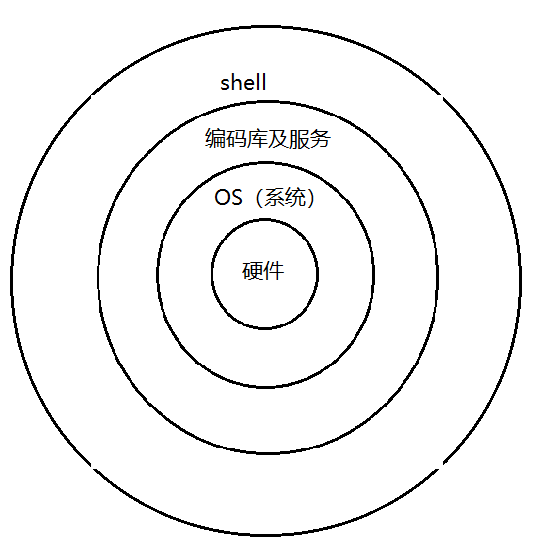

# 进程、线程与协程

* 进程的目的就是担当分配系统资源（ CPU时间、内存 ）的实体
* 线程是操作系统能够进行运算调度的最小单位
* 协程是一种用户态的轻量级线程， 无法利用多核资源。
* IO密集型应用的发展: 多进程 -> 多线程 -> 事件驱动 -> 协程
* CPU密集型应用的发展: 多进程 -> 多线程
* 调度和切换的时间: 进程 > 线程 > 协程

## 进程与线程的资源共享
* 文件：文件句柄（打开的文件）
* 寄存器： 存储状态， 比如线程在进程中的状态
* 栈： 函数调用栈（栈在内存中）

## 进程
> 操作系统能够同时运行的进程数取决于 cpu 核数， 一核处理一个进程

> 内核负责产生进程

进程就是操作系统运算的一个单位， 进程必须占用cpu资源，占用的数据和程序本身也要依赖内存

每个程序都是一个单独的进程， 那么操作系统怎么多程序同时执行呢， 操作系统选择了`分时`运行， 一个程序运行一小段时间就切到另一个程序。 一直如此，如果进程之间切换频率非常高就非常消耗系统资源了

现代的多核计算机， 就可以将进程分配到不同的核上运行， 理想状态是一个核处理一个线程， 比如`4核`计算机， 如果4个进程， 那就正好一个核运行一个进程， 如果同时运行的进程超过了4个， 那么超过的进程依旧时要切时间片， 也就是`分时`来运行

### 多进程
多进程又分为 父进程和子进程，  

父进程负责创建子进程，  子进程就相当于是克隆的父进程， 各自独立干活， 他们各自所占的系统资源也都独立， 这也会导致进程间的通信困难和系统资源被占用 ， 所以有了多线程

## 线程
> 内核负责产生线程

线程是比进程更小的单位

### 多线程
线程必须依赖于进程， 并且线程之间共享当前进程的一部分资源（硬件资源、软件资源）， 当然每个线程也有自己的数据， 只不过很小，

#### 资源争抢
共享资源就难免会造成资源争抢的情况， 可以想象一下所有人蜂拥而上抢钱的场景

为了防止资源争抢， 这也就表明需要提供协调机制， 防止进程之间和线程之间产生冲突， 另一方面允许进程之间和线程之间共享资源

## 协程
> 不需要内核就可以产生协程

因为不需要内核就可以产生协程， 所以协程比线程还要轻量级， 所以协程属于`用户态`， 或者说是轻量级的线程

因为协程不需要和系统交互， 不用使用系统功能

## IO密集型
IO是输入输出， 计算机内部和计算机外部进行输入输出这就叫输入输出，IO操作一般是网络应用相关的。 再比如：访问数据库也是。

在网络访问的过程中， 输入是把数据给cpu， 也就是: 网卡 -> cpu , 他们之间通信要经过数据总线， 而数据总线的带宽又是收到限制的，IO操作就很昂贵

所以一般开发中的IO密集型都是针对网络的， Node.js就是针对IO密集型这种应用进行优化的 

### IO密集-多进程
最早就是通过开启多进程来处理 IO密集型的情况, nginx就是典型的解决方案， 但是nginx现在也逐渐支持事件驱动了，

但进程过多也会导致性能的直线下降

### IO密集-事件驱动
事件驱动就是一种单线程的处理方案, 异步队列快速处理进入的请求

### IO密集-协程
这是IO密集型应用的发展趋势

协程是一种**用户态**的轻量级线程， 无法利用多核资源。

## CPU密集型
CPU密集型就是存粹的科学运算， 大量的运算存粹的消耗CPU性能

当然也不是所有的运算都适合多进程和多线程方案， 有的运算用多进程和多线程运算无效，串行计算就无法使用多进程了。

### 串行运算
计算必须连续并且有依赖关系

比如圆周率计算

### 并行运算
比如说渲染计算

## 由深入浅看linux
首先操作系统底层肯定免不了硬件支持， 硬件给操作系统提供支持, 这里系统指的是linux内核， linux提供核心功能， 有6大子系统: 

1. 存储管理
2. CPU和进程管理
3. 文件系统
4. 设备管理和驱动
5. 网络通信
6. 系统的初始化（引导）
7. 系统调用

这些功能跑在一种状态下， 他叫`内核态`。 他们以api 的形式或是操作系统的信号系统对外层提供这些功能，
操作系统的外层就是一些提供一些编码的支持库、提供服务的进程、到最外层就是我们平时看到的`shell`， 也就是图形界面 ，

而我们的图形界面就是跑在`用户态下`的

列表结构:

* shell 图形界面
* 编码库及服务等
* OS操作系统
* 硬件

