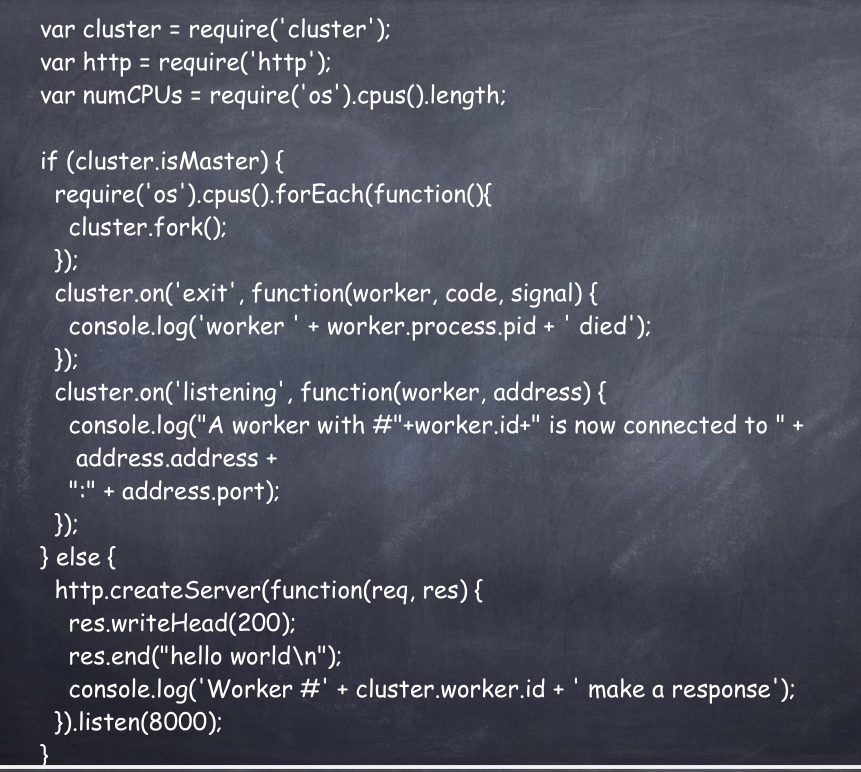
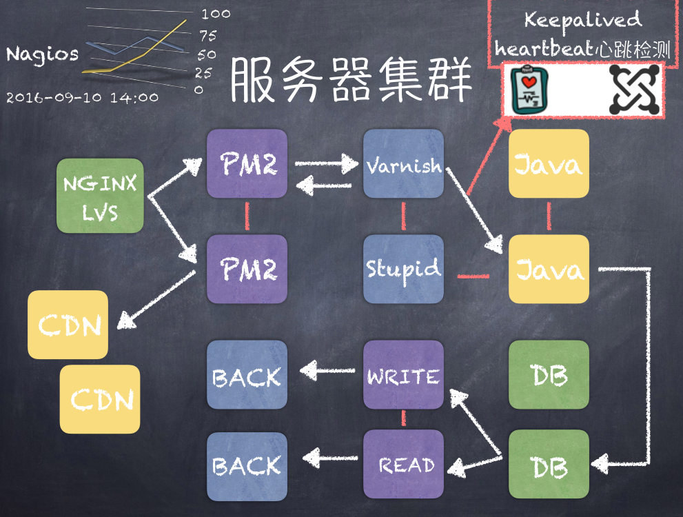
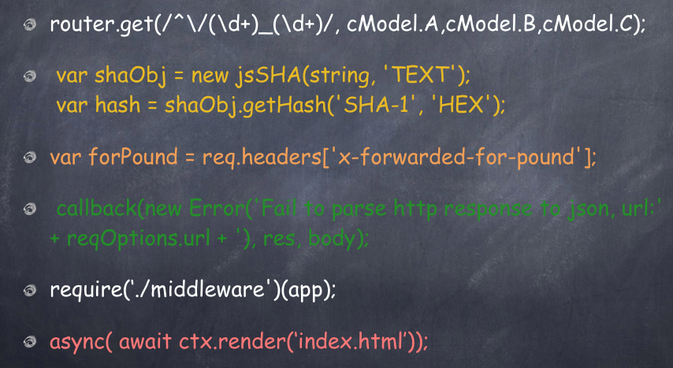

# 大规模架构
这个笔记大部分还是图吧， 水平不够， 无法详细描述，总有一天我会懂的

## 四个方向
1. SPA （csr）
* 借助现代各种各样的前端框架， 生产出来dist， 和JAVA后台存储在一起，利用nginx解决调跨域
2. Node + Spa  (node + csr)
* 为了减少跨域， 中间多了一层Node， 但是前端路由就会和后端路由产生冲突， 所以后端就需要 `History-fallback` 把所有请求都转回index.html, Node负责和java通信

3. SSR + mpa
* 纯靠Node  + 模板引擎， 前端的Vue 就当Jq一样引入使用

4. 同构化
* 前后端公用一套模板引擎

## MVC
这是最经典的架构， 无论大项目还是小项目， 如果你不知道用啥， 用MVC就对了

## .Net多层架构

## JavaWeb 多层架构

## 预备上限

* 前端工程化的搭载动态文件的MAP分析压缩打包合并至CDN
* 单测、压测 性能分析工具发现Bug
* 编写nginx-conf实现负载均衡和反向代理
* PM2启动应用程序小流量灰度上线，修复BUG

## 多线程
* Master进程均为主进程，Fork可以创造主从进程。

* 通过child_process可以和NET模块组合，可以创建多个线程并监听统一端口。通过句柄传递完成自动重启、发射自杀信号、限量重启、负载均衡。

* Node默认的机制是采用操作系统的抢占式策略。闲着的进程争抢任务，但是会造成CPU闲置的IO暂时并未闲置。Node后来引入了Round-Robin机制，也叫轮叫调度。主进程接受任务，在发

* 每个子进程做好自己的事，然后通过进程间通信来将他们连接起来。这符合Unix的设计理念，每个进程只做一件事，并做好。将复杂分解为简单，将简单组合成强大。

## PM2
> pm2 是一个带有负载均衡功能的Node应用的进程管理器.当你要把你的独立代码利用全部的服务器上的所有CPU，并保证进程永远都活着，0秒的重载。

1. 内建负载均衡（使用Node cluster 集群模块）
2. 后台运行
3. 0秒停机重载
4. 具有Ubuntu和CentOS 的启动脚本
5. 停止不稳定的进程（避免无限循环）
6. 控制台检测
7. 提供 HTTP API
8. 远程控制和实时的接口API ( Nodejs 模块,允许和PM2进程管理器交互 )测试过Nodejs v0.11 v0.10 v0.8版本，兼容CoffeeScript,基于Linux 和MacOS.

**老袁写的pm2**

## 服务器集群架构
varnish 必须保证h和java服务相互连通， 需要keepalived保证连接， 但连接了没用还要保证是否挂了， 所以需要心跳监测保证服务器

## 项目组成结构

* app.js 启动文件
* bin 命令行
* config 配置文件
* controllers 路由
* lib  共用库
* middleware 中间件
* models 数据模型
* nginx-conf nginx的配置
* test 单元测试
* views 视图模板
* receiver-master 接收webapp编译过来的资源

* public 静态文件及css（ 上线时用shell 脚本塞到远程cdn ）

## 经典代码
* 相似的路由可以通过正则匹配
* nodejs有非常完备的加密
* header 至关重要
* node 容错， 用捕获错误处理业务逻辑
* 默认应用目录下的index文件

