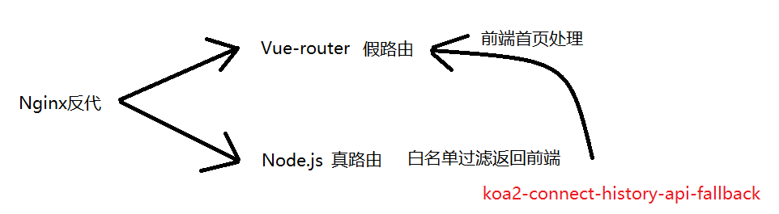

# 前后端架构选型

## SPA + Node.js
webpack 打包以src/index.js 为路口， 前端使用`Vue-router` 的假路由 ， 后端使用Node.js， 如:`koa`， 后端是真路由, 

使用Nginux作为反向代理指向两处， 前端通过`webpack`打包， 利用 `koa2-connect-history-api-fallback`的白名单让Node不处理前端的部分路由，跳转回前端首页

## 真SPA + MPA的转化
> 比如: MPA + swig模板

但是swig模板引擎的静态资源需要注入到合适的位置