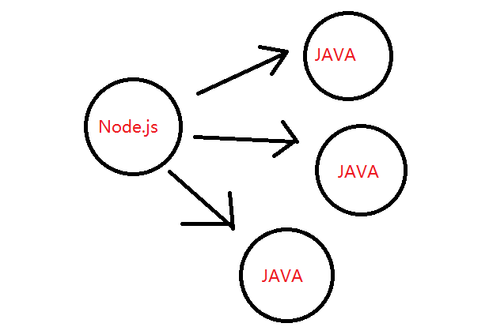
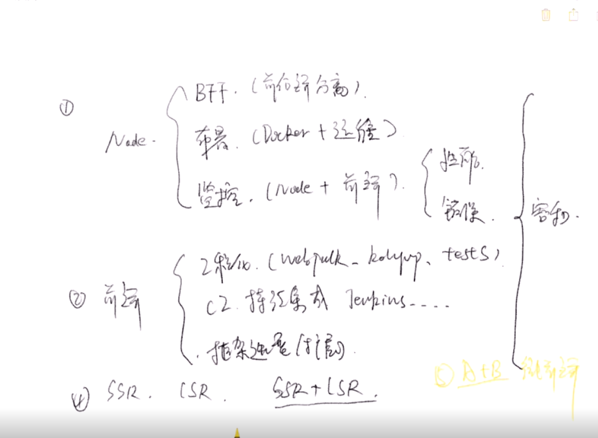

# 架构体系

一个前端架构师的必备技能

### Node.js:

* BFF ( 前后端分离 )
* 部署 ( Docker + 运维 )
* 监控 ( Node + 前端 ) 
  * 性能监控
  * 错误监控

### 前端:
* 工程化 ( webpack、 rollup、 tests )
* CI  持续集成 , Jenkins
* 框架选型( 基于框架的内部扩展 )

### 融合：
* SSR
* CSR
* SSR + CSR
* 微前端( 前端跨组 )

## BFF架构

使用 `Node.js` 做客户端于java之间的代理层， 转发请求， 

好处: 
1. 削减后端接口
2. 解决跨域
3. SEO，页面直出

