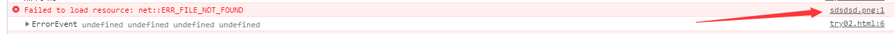
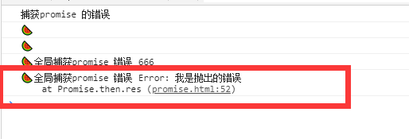
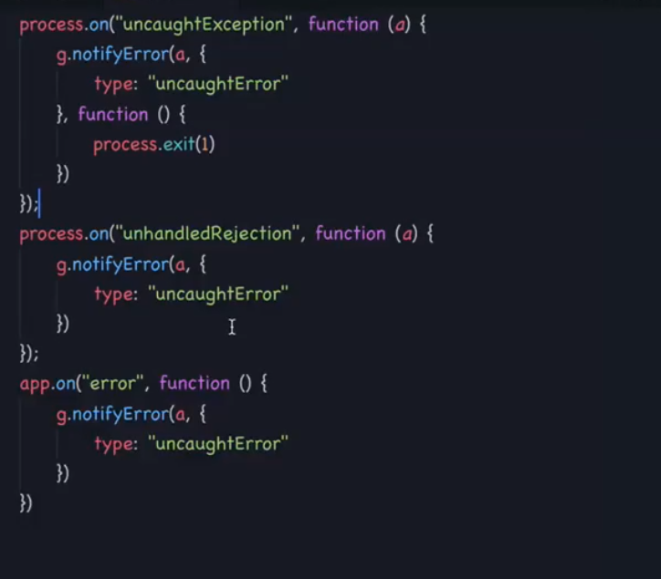

# 前后端服务容错处理
> 商业化监控平台: https://www.fundebug.com/

我们可以多参照此类的项目， 看看其源码， 尽管内部可能存在代码混淆， 但关键的代码还是可以一眼看出的， 由此可以多增长增长我们的知识点， 比如这个`fundebug`， 里面就可以找到它监听`Node`的几个关键事件,

学到就是你的了


## try catch 

try catch 可以捕获大多的错误， 但无法捕捉异步错误与 语法错误， 并且在语法错误出现时 ,js 根本不会向下执行, 除非是不同的`script` 下的 js 代码， 不同`script`块之间的js 互不影响

语法错误: 
```
try {
  // 单双引号造成语法错误
  var error = "err'
}catch(e) {
  console.log(e)
}
```

无法捕获异步:
```
try {
  setTimeout(() => {
    console.log(error)
  })
}catch(e) {
  console.log(e)
}
```


那如何捕获这些错误了，  利用 `onerror` 事件来捕获意料之外的错误

```
window.onerror = function(msg, url, row, col, error) {
  console.log(msg, url, row, col, error)
  // return true 可以抵消错误报错， 否侧依旧向上抛出
  return true
}

```


看到这里， 你是不是觉得，错误都搞定了？ 

不是的， 还有

图片资源的 404 错误你怎么处理呢？
```
 
```

想要处理图片的错误，我们可以考虑在页面事件捕获阶段将其处理（事件出发阶段）， 因此，我们调整下 error 事件的方式

```

<script>
                    // 错误信息， 出错文件， 行， 列， 错误详细
window.addEventListener('error', (msg, url, row, col, error) => {
  console.log(msg, url, row, col, error)
  // 这里不能 return true , 不然其他的就干不了了
  return false
}, true)

</script>
```


但是事实是： 




这样也只是只能捕获到错误， 但无法消除错误提示


## promise 

你不能保证没事没刻都为每一个 `promise` 处理`catch` 事件,  并且 上面说的 `onerror`事件也无法处理`promise` 抛出的错误

```
Promise.reject("promise error").catch(e => {
  console.log('捕获promise 的错误')
})

new Promise((resolve, reject) => {
  
  reject('666')
}).catch(err => {
  console.log('🍉')
})

new Promise((resolve, reject) => {
  
  reject('666')
}).catch(err => {
  console.log('🍉')
})


输出： 

捕获promise 的错误
🍉
🍉


```

这时就祭出了我们的 大杀器， 全局捕获 `reject`
```
window.addEventListener('unhandledrejection', (e) => {
  e.preventDefault()
  console.log('🍉全局捕获promise 错误', e.reason) // reason : reject传入的信息
  // 记得return true
  return true
})

```


此时， 我们就成功处理了 promise,


那让我们再提高错误难度试试， then中手动来抛出异常

```

new Promise((resolve, reject) => {
  resolve()
}).then(res => {
  throw new Error('我是抛出的错误')
})

```

嘿嘿， 太厉害了， 依旧捕捉到了错误， 牛



## iframe


```
window.frames[0].onerror = function() {
  console.log('iframe 错误, 建议抛给主站处理')
}

```


## Node.js

从`fundebug` 偷师而来的错误监控api




