# HTTP
  
## 什么是HTTP协议
> 为什么称为协议， 协议就是一套规范， 我们必须遵守这套规范， 否则工作无法进行

1. HTTP是超文本传输协议，从www浏览器传输到本地浏览器的一种传输协议，网站是基于HTTP协议的，例如网站的图片、CSS、JS等都是基于HTTP协议进行传输的

2. HTTP协议是由从客户机到服务器的请求(Request)和从服务器到客户机的响应(response)进行约束和规范

**HTTP发展历程**
现在大部分网站实行的是HTTP1.1协议， HTTP1.1实现了长连接

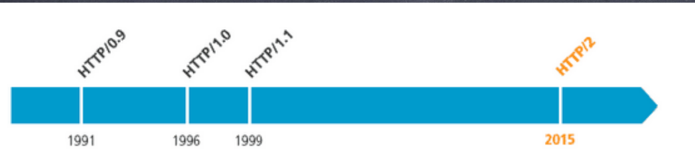

## HTTP 请求模型
这是一张最最简单的概括图， 这也是HTTP的最基本最顶层设计，  服务器和客户端一对一， 谁发的请求服务器就相应给谁
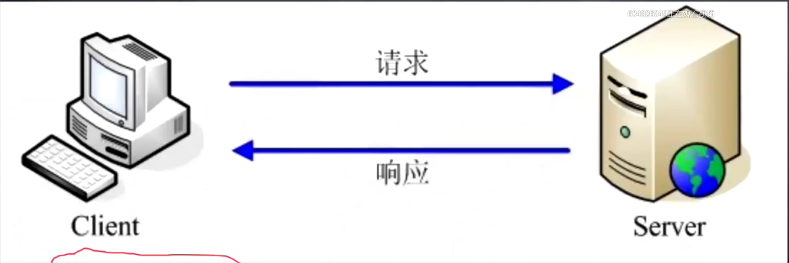

## TCP/ IP协议栈

协议分为两种， 一种是纸面上的， 一种是真正实际上的标准

1. 纸面标准:  ISO / OSI ( 国际标准化组织制定的协议 )
2. 实际标准： TCP / IP 协议  ， 这套协议是逐渐发展起来的， 但在发展过程中有很多没有考虑到， 有很多缺陷， 但基础建设推到重来几乎不可能， 所以制定了标准化规范  ， 但事实上仍在使用TCP / IP规范

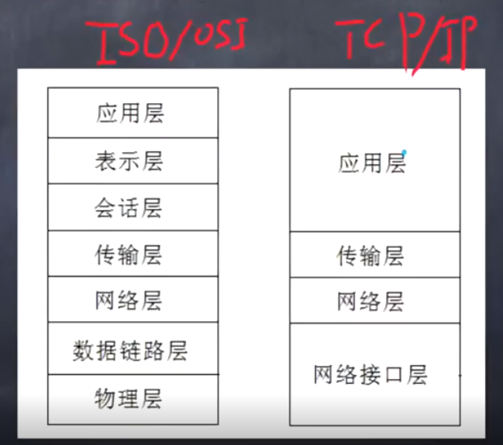

首先协议分层的目的就是为了让功能更加直观， 在使用上不会乱套， 如： 实际使用过程中， 我们的程序只能使用应用层， 我们使用的ping命令是在网络层， ping 发送的是Icmp协议， 发送的是报文

TCP 协议无法跨层，只能逐层传递，  一旦跨层就相当于你破坏了这个协议， 

**协议层**

1. 应用层
  * 为用户提供所需要的各种服务，列如：HTTP、 FTP、 DNS、 SMTP等

2. 传输层
  * 为应用层实体提供端到端的通信功能， 保证数据包的顺序传送及数据的完整性。
  * 该层定义了两个主要的协议： 传输控制协议（ TCP ） 和用户数据报协议（ UDP ）

3. 网络层
  * 主要解决主机到主机的通信问题。 IP协议是网际互联网层最重要的协议。
  * 也就是说，网络层保证的是两台机器是通的

4. 网络接口层
  * 负责监视数据在主机和网络之间的交换。

  

**ISO协议**
ISO协议将细分了应用层， 因为在tcp当初设计的时候没有考虑过多的东西， 导致了HTTP协议的天生缺陷， 不能保持会话
1. 应用层
  * 提供接口
2. 表示层
  * 本协议的数据处理
3. 会话层
  * 维持通信状态

## 在TCP/IP协议栈中的位置
1. 目前普遍应用版本HTTP1.1 
2. 正在逐步向HTTP2 迁移
  * HTTP2 拥有HTTPS的加密特性， 并且全双工， 并且可以连续传输， 端口也是443
3. HTTP默认端口 80
4. HTTPS默认端口为 443

HTTP 不安全的原因在于它的传输时明文传输， 所以诞生了HTTPS

HTTPS 是在HTTP协议偏底层的地方添加了TLS 模块， 使用了SSL加密库

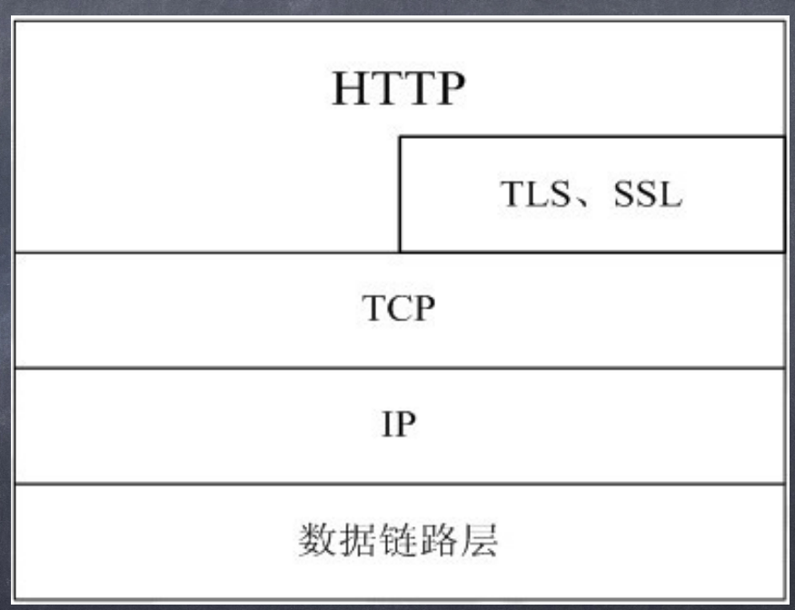

## HTTP的工作过程
> 什么叫事物， 一个工作可以分解成若干个步骤， 为了完成工作必须按照步骤串行处理， 当在处理这些步骤时但凡有一个步骤出错， 整个工作就算失败的， 凡是具有这种特征的就叫事物

* 一次HTTP操作称为一个事务，其工作过程可分为四步：
* 1)首先客户机与服务器需要建立连接。只要单击某个超级链接，HTTP的工作开始。
* 2)建立连接后，客户机发送一个请求给服务器，请求方式的格式为：统一资源标识符(URL)、协议版本号，后边是MIME信息包括请求修饰符、客户机信息和可能的内容。
* 3)服务器接到请求后，给予相应的响应信息，其格式为一个状态行，包括信息的协议版本号、一个成功或错误的代码，后边是MIME信息包括服务器信息、实体信息和可能的内容。
* 4)客户端接收服务器所返回的信息通过浏览器显示在用户的显示屏上，然后客户机与服务器断开连接。如果在以上过程中的某一步出现错误，那么产生错误的信息将返回到客户端，有显示屏输出。对于用户来说，这些过程是由HTTP自己完成的，用户只要用鼠标点击，等待信息显示就可以了

## 请求与响应
* HTTP请求组成：请求行、消息报头、请求正文。
* HTTP响应组成：状态行、消息报头、响应正文。
* 请求行组成：以一个方法符号开头，后面跟着请求的URI和协议的版本。
* 状态行组成：服务器HTTP协议的版本，服务器发回的响应状态代码和状态代码的文本描述。

HTTP 协议是文本， 每一行数据以换行分割

请求行在浏览器中被拆分了

1. 请求行 / 响应行
  * 请求方法
  * 请求URL
  * HTTP协议及版本

2. 请求头 / 响应头
3. 请求体 / 响应体

请求结构
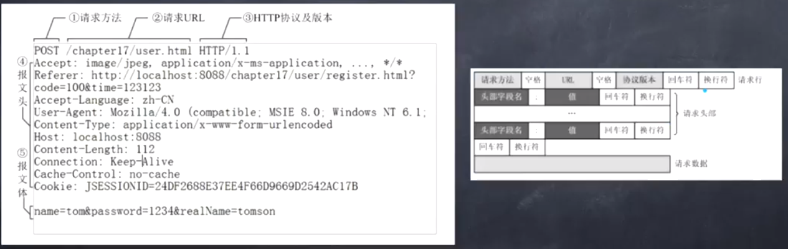

响应结构
> 图片之类的数据就会以二进制的形式填充在响应体中 

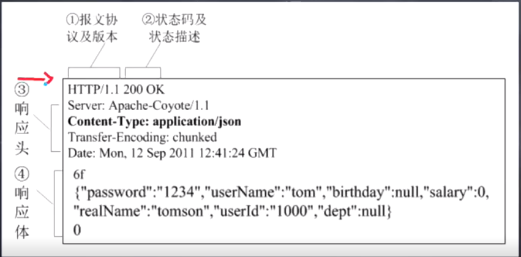

请求和响应之间具有一定的联系， 比如请求体`Content-Encoding` 设置了允许压缩， 那么服务器就也会进行压缩，当然也是需要服务器配合

## 请求方法
* GET： 请求获取Request-URI所标识的资源
* POST： 在Request-URI所标识的资源后附加新的数据
* HEAD： 请求获取由Request-URI所标识的资源的响应消息报头
* PUT： 请求服务器存储一个资源，并用Request-URI作为其标识
* DELETE： 请求服务器删除Request-URI所标识的资源
* TRACE： 请求服务器回送收到的请求信息，主要用于测试或诊断
* CONNECT：HTTP/1.1协议中预留给能够将连接改为管道方式的代理服务器。
* OPTIONS： 请求查询服务器的性能，或者查询与资源相关的选项和需求

## 浏览器行为与HTTP协议

处理流程:
1. 输入网址并回车
2. 解析域名
3. 浏览器发送HTTP请求
4. 服务器处理请求
5. 服务器返回HTML响应
6. 浏览器处理HTML页面
7. 继续请求其他资源

看第一张图， 坐在座位上的人是 用户， 小圆球是浏览器， 用户通过向浏览器发送指令浏览器才能工作， 用户要求该浏览器访问“ google.com ” 网页， 但浏览器并不会马上工作， 再次之前会进行准备工作，

第二幅图， 浏览器会测试网络连通性， 浏览器来到一个守卫面前， 这个守卫可能是网关或者是防火墙， 它决定了你访问外网或者是内网

第三张图， 浏览器成功访问到了外网， 但是我们输入的域名只是一串字符串，并不能找到真实的地址， 所以我们需要到达`DNS服务器`进行域名解析， 找到目的地的ip地址， DNS实际上就是一个数据库， 里面以key & value的形式一一对应域名及IP地址

第四张图， 浏览器拿到ip地址后， 就直接奔向了ip地址，这叫请求， 但现实中的实际情况会复杂的多，不可能一根网线直达目的地， 所以途中会有很多的中继站（路由器）转发， 这也是为了提升传输数据的可靠性

第五张图， 浏览器访问到了`google.com`的ip地址， 但这棵树上站了好多的鸟， 这上面的鸟每一个都代表着一个服务器， 他们共有一个Ip, 
这就是一个服务器集群， 通过反向代理把所有服务器统一起来

第六张图， 浏览器通过反向代理的转发成功找到了一台服务器， 这时候请求就算是送到了， 服务器也进行响应

第七张图， 浏览器返回， 这就是响应

第八张图， 浏览器解析数据， 渲染页面， 将数据呈现给用户

浏览器在拿到过ip地址后会将其暂时缓存， 避免再度访问时又重复解析

## 游戏加速器原理

加速器实际解决的是一个跨网的问题， 在运营商内部， 他们的网络是很快的， 但是一旦运营商不同， 比如电信访问联通， 这个节点就会存在速度慢的问题，

还有一些情况是线路过长的问题， 比如访问美国， 日本的网络， 你就得跨过海底光缆， 这时候就又可能运营商帮你绕了远路， 多了很多的障碍

加速器就是帮助你绕过这些障碍， 短路一些线路

## 运营商知识
1. 请求和响应的路由路径
在运营商处被处理

2. DNS解析
当然运营商是有的，但不一定要是在运营商， 我们也可以自己去架设， 比如阿里云的

3. 广告劫持
运营商会劫持你的数据量， 在合适的地方插入脚本， 当然你可以投诉它， 可以赔钱的

## HTTP缓存机制

* 缓存会根据请求保存输出内容的副本，例如html页面，图片，文件，当下一个请求来到的时候：如果是相同的URL，缓存直接使用副本响应访
* 问请求，而不是向源服务器再次发送请求。
* 缓存的优点：
  * 减少相应延迟
  * 减少网络带宽消耗

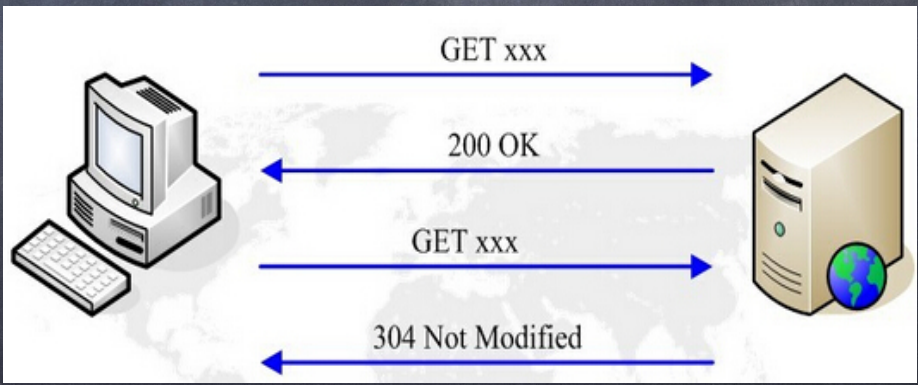

浏览器发起请求后，先检查有无缓存， 当发现无缓存后， 回向服务器索要资源，服务器返回缓存的相关配置， 浏览器根据服务器返回的配置， 先将资源缓存到本地， 然后返回给浏览器呈现

第二次请求时 -> 有没有缓存 -> 有没有过期（根据配置上的时间戳）

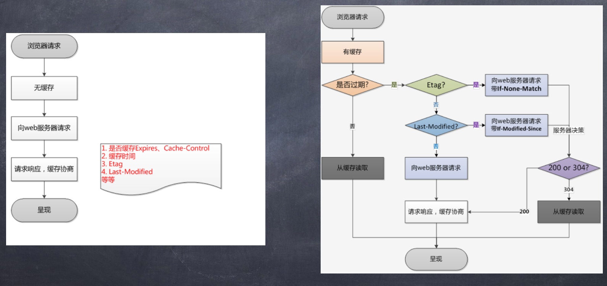

## 了解两种缓存策略

* 强制缓存与对比缓存
  * 强制缓存，服务器通知浏览器一个缓存时间，在缓存时间内，下次请求，直接用缓存，不在时间内，执行比较缓存策略。
  * 比较缓存，将缓存信息中的Etag和Last-Modified通过请求发送给服务器，由服务器校验，返回304状态码时，浏览器直接使用缓存。
* Etag/If-None-Match策略
* Last-Modified/If-Modified-Since策略

## HTTPS协议分析

* HTTPS协议的安全性由SSL协议实现，当前使用的TLS协议1.2版本包含了四个核心子协议：握手协议、密钥配置切换协议、应用数据协议及报警协议。
* 数字证书：数字证书是互联网通信中标识双方身份信息的数字文件，由CA签发。
* CA：CA（certification authority）是数字证书的签发机构。作为权威机构，其审核申请者身份后签发数字证书，这样我们只需要校验数字证书即可确定对方的真实身份。
* HTTPS协议、SSL协议、TLS协议、握手协议的关系
  * HTTPS是Hypertext Transfer Protocol over Secure Socket Layer的缩写，即HTTP over SSL，可理解为基于SSL的HTTP协议。HTTPS协议安全是由SSL协议实现的。
  * SSL协议是一种记录协议，扩展性良好，可以很方便的添加子协议，而握手协议便是SSL协议的一个子协议。
  * TLS协议是SSL协议的后续版本，本文中涉及的SSL协议默认是TLS协议1.2版本

  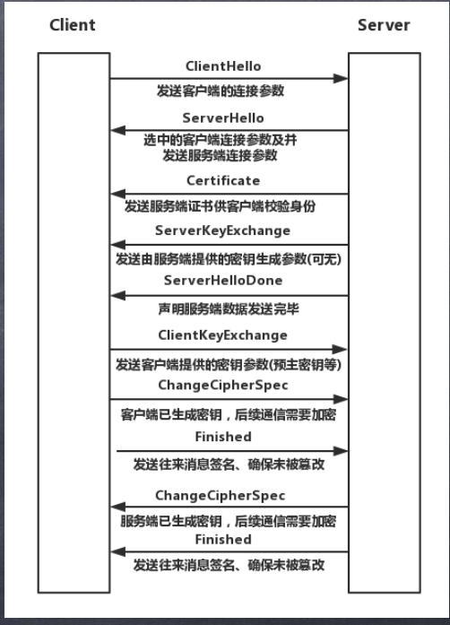

## HTTP2协议分析
* 使用二进制格式传输，更高效、更紧凑。
* 对报头压缩，降低开销。
  * 能规避一些中间人拦截头部插入信息
* 多路复用，一个网络连接实现并行请求。
  * 使用一个连接， 并发的进行数据传输
* 服务器主动推送，减少请求的延迟
* 默认使用加密

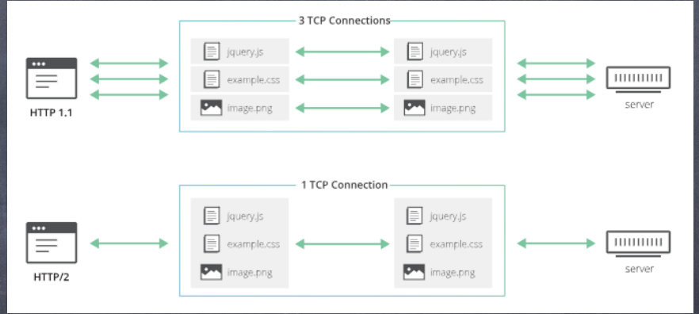

**HTTP2的伪头字段**
> 伪头就是拿来替代之前的请求行的

伪头部字段是http2内置的几个特殊的以”:”开始的key，用于替代HTTP/1.x中请求行/响应行中的信
息，比如请求方法，响应状态码等
* :method 目标URL模式部分（请求）
* :scheme 目标URL模式部分（请求）
* :authority 目标RUL认证部分（请求）
* :path 目标URL的路径和查询部分（绝对路径产生式和一个跟着"？"字符的查询产生式）。（请求）
* :status 响应头中的HTTP状态码部分（响应）

## 了解HTTP 3
> 现在还只是纸上协议

* HTTP-over-QUIC被更名为HTTP 3
* QUIC协议是什么（Quick UDP Internet Connection）
* HTTP 3与HTTP 1.1和HTTP 2没有直接的关系
* HTTP 3不是http2的扩展
* HTTP 3将会是一个全新的WEB协议
* HTTP 3目前处于制订和测试阶段

## HTTP与反向代理
正向代理就是你翻墙，或者是出国不方便， 找了代购

反响代理就是你进小区进不去， 找门卫大爷帮忙叫人

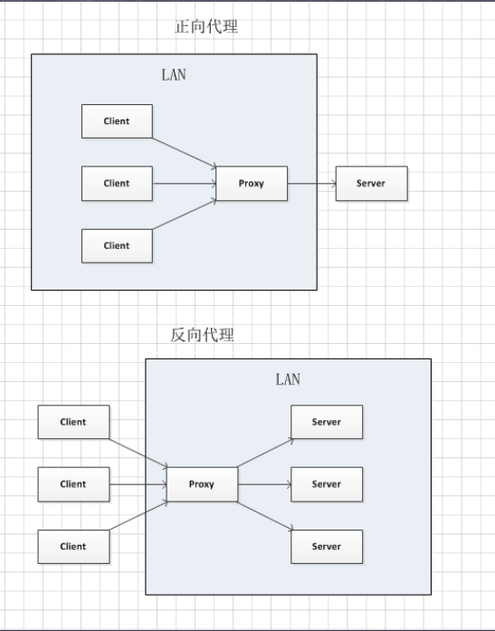

**反向代理的用途**
* 加密和SSL加速
  * 抽离加密逻辑， 分担服务器压力
* 负载均衡
  * 自动平衡请求压力
* 缓存静态内容
* 压缩
  * gzip
* 减速上传
  * 控制上传下载的速度，比如百度网盘
* 安全
* 外网发布
  * 外网入口指向nginx

## 反向代理做负载均衡

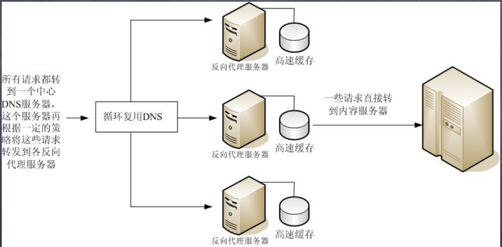

## 让nginx跑起来
* 在Linux下的两种安装方案：yum/apt安装、源码编译安装
* 准备环境：Linux服务器、gcc编译器、nginx源代码
* 获取nginx源码：http://nginx.org
* 编译安装nginx源码
* 配置规则