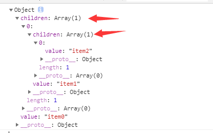

# 第一专题


## reduce串行Promise
```
const timeout = ms =>
    new Promise((resolve, reject) => {
        setTimeout(() => {
    resolve();
}, ms);
});
const ajax1 = () =>
    timeout(2000).then(() => {
        console.log("1");
    return 1;
});
const ajax2 = () =>
    timeout(1000).then(() => {
        console.log("2");
    return 2;
});
const ajax3 = () =>
    timeout(2000).then(() => {
        console.log("3");
    return 3;
});
const mergePromise = (ajaxArray) =>{
    //1,2,3 done [1,2,3]
    //【代码书写处】
}
- mergePromise([ajax1, ajax2, ajax3]).then(data => {
    console.log("done");
    console.log(data); // data 为 [1, 2, 3]
});
- // 执行结果为： 1 2 3 done [1,2,3]
```

### 答案
老袁说最好用 reduce 实现

```


// ------------方法二-------------------
let data = []
while(ajaxArray[0]){
    await ajaxArrayp.shift().then(res => data.push(res))
}

```


## 解决死循环

```
$('#test').click(function(argument) {
    console.log(1);
});
setTimeout(function() {
    console.log(2);
}, 0);
while (true) {
    console.log(Math.random());
}
```

### 答案
* web work, 把死循环放到另外的线程
* Concurrent.Thread.js 将执行代码丢入异步线程


## js模拟指针移动
```
var s = [];
var arr = s;
for (var i = 0; i < 3; i++) {
    var pusher = {
        value: "item"+i
    },tmp;
    if (i !== 2) {
        tmp = []
        pusher.children = tmp
    }
    arr.push(pusher);
    arr = tmp;
}
console.log(s[0]);
```

### 答案
记住是引用关系



## 如何在项目中使用函数式编程

可以借助现有框架的源码， 比如 `underscore`, `lodash` 等等开源库， 在这些源码基础上， 扩展出自己的逻辑， 建议使用`underscore` ,这个比较容易理解


